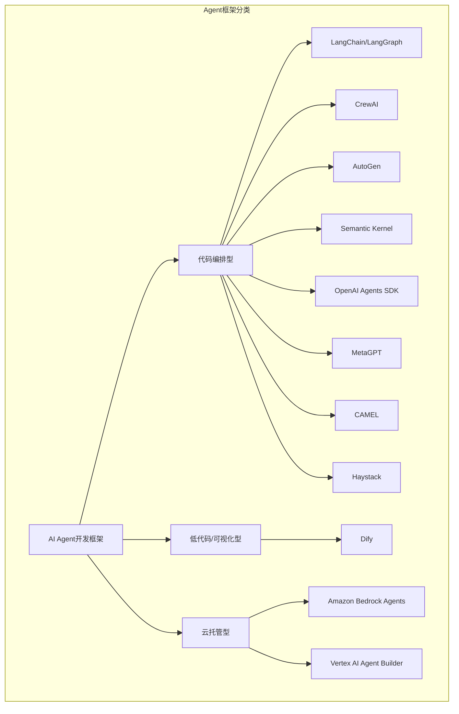
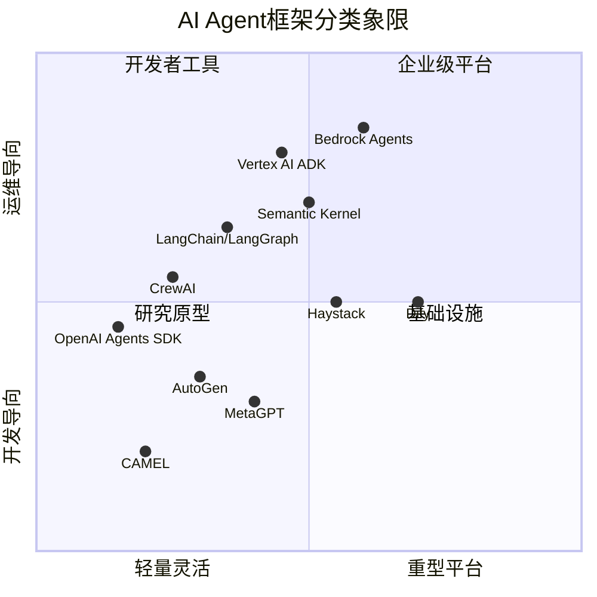
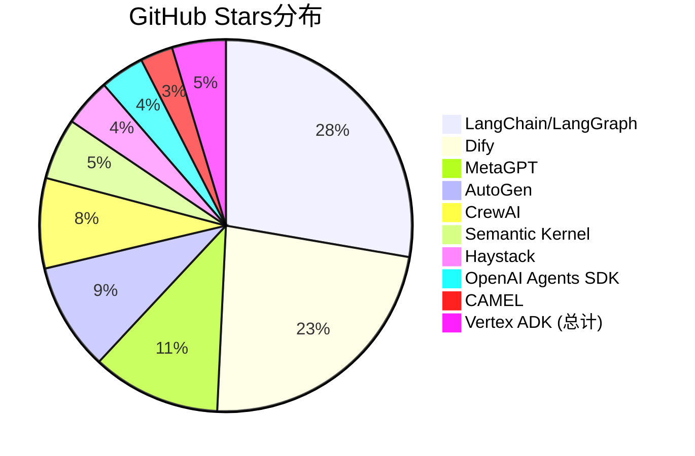
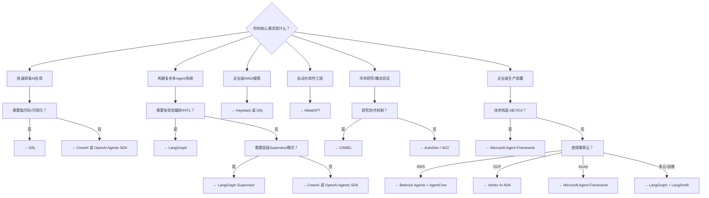
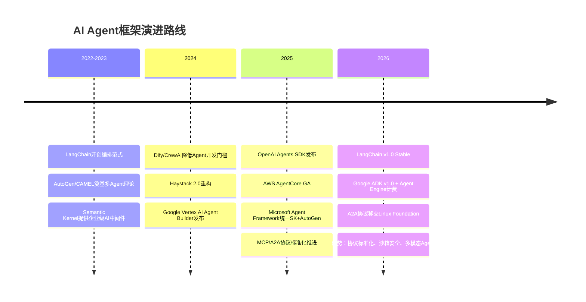

# 主流AI Agent开发框架深度调研报告（2025-2026）

---

> **报告日期：** 2026年5月12日
> **研究方法：** 官方文档追溯、GitHub社区数据分析、论文研读、技术博客交叉验证
> **覆盖范围：** 10个主流AI Agent开发框架

---

## 一、研究概述

### 1.1 研究背景与目的

2024-2026年是AI Agent框架的爆发期。从LangChain开创LLM应用编排范式，到微软/Semantic Kernel和AutoGen、Google ADK、OpenAI Agents SDK等重量级玩家的加入，Agent框架生态呈现出"百舸争流"的格局。本报告旨在对当前主流的10个Agent开发框架进行系统性调研，从架构设计、开发体验、生产就绪度、生态成熟度等多个维度进行横向对比，为开发者的技术选型提供参考。

### 1.2 研究方法

- **官方文档与GitHub仓库** — 追溯每个框架的核心抽象、API设计、版本演进
- **社区数据** — GitHub Stars、贡献者活跃度、Release频率、PyPI下载量
- **论文与白皮书** — AutoGen、MetaGPT、CAMEL等有学术论文支撑的框架追溯其理论基础
- **技术博客与评测** — 社区生产实践、Benchmark结果、横向对比评测
- **企业案例** — 生产环境部署案例、行业采用情况

### 1.3 Agent框架分类体系



---

## 二、框架全景概览

### 2.1 主流框架一览表

| 框架 | 开发者 | 首次发布 | GitHub Stars | 协议 | 语言 | 定位 |
|------|--------|---------|-------------|------|------|------|
| **LangChain/LangGraph** | LangChain Inc. | 2022.10 | ~135K / ~31K | MIT | Python, TS | 通用Agent编排框架 |
| **CrewAI** | CrewAI Inc. | 2023.11 | ~47K | MIT | Python | 多Agent角色协作 |
| **AutoGen** | Microsoft Research | 2023.09 | ~56K | MIT | Python, .NET | 多Agent对话编排 |
| **Semantic Kernel** | Microsoft | 2023.03 | ~32K | MIT | C#, Python, Java | .NET AI编排中间件 |
| **Dify** | LangGenius Inc. | 2023.05 | ~138K | Apache 2.0 (modified) | Python, TS | 低代码AI应用平台 |
| **OpenAI Agents SDK** | OpenAI | 2025.03 | ~23K | MIT | Python | 轻量多Agent编排 |
| **MetaGPT** | DeepWisdom | 2023 | ~67K | MIT | Python | 软件工程自动化 |
| **CAMEL** | CAMEL-AI社区 | 2023.03 | ~17K | Apache 2.0 | Python | 多Agent协作研究 |
| **Haystack** | deepset GmbH | 2019.11 | ~25K | Apache 2.0 | Python | RAG与企业搜索 |
| **Vertex AI Agent Builder (ADK)** | Google Cloud | 2024.04 | ~28K (ADK) | Apache 2.0 | Python, Go, Java, TS | 托管Agent平台 |
| **Amazon Bedrock Agents** | AWS | 2023.07 | - | 闭源 | Python, Java, TS | 云托管Agent服务 |

### 2.2 按技术路线分类



---

## 三、框架深度解析

### 3.1 LangChain / LangGraph

**基本信息：** LangChain Inc.（Harrison Chase创立），2022年10月发布，2026年4月发布v1.0 Stable。LangChain ~135K Stars，LangGraph ~31K Stars，MIT协议。

#### 核心架构

LangChain v1.0 采用四层架构：

| 层次 | 组件 | 职责 |
|------|------|------|
| 核心抽象层 | `langchain-core` | Runnables、Messages、Prompts、Tools、Agents、Memory、Callbacks |
| 框架层 | `langchain` | Chains、Agent工厂、Middleware系统、工具注册表 |
| 图编排层 | `langgraph` | 有状态有向图引擎，节点-边模型，Checkpointing，Human-in-the-Loop |
| 可观测层 | `langsmith` | 链路追踪、调试、评估、数据集管理 |

**编排模式：** LangGraph支持链式、条件分支、循环、Supervisor模式（中央协调）、Swarm/Handoff模式（点对点交接）、层级式（Subgraph嵌套）、并行扇出（Send API）等多种模式。

**记忆管理：** 通过Checkpointer实现完整状态持久化，支持InMemorySaver/SQLite/Postgres后端，支持时间旅行调试和崩溃恢复。

```python
# LangChain v1.0风格：创建Agent
from langchain.tools import tool
from langchain.agents import create_agent

@tool
def search_kb(query: str) -> str:
    """搜索内部知识库"""
    return f"关于'{query}'的查询结果"

agent = create_agent(
    model="openai:gpt-4o",
    tools=[search_kb],
    system_prompt="你是一个智能助手，使用知识库工具回答用户问题。",
)

for chunk in agent.stream(
    {"messages": [{"role": "user", "content": "查询AI Agent框架最新发展"}]},
    stream_mode="updates"
):
    print(chunk)
```

#### 成熟度评估

| 维度 | 评分 |
|------|------|
| API稳定性 | v1.0承诺18个月无破坏性变更 |
| 生产案例 | Uber、LinkedIn、Replit等，月活下载量超1亿 |
| 文档质量 | 完善（reference.langchain.com），生态课程丰富 |
| 企业支持 | NVIDIA合作伙伴，Agent Builder正式发布 |

#### 优点
- 生态最庞大：500-600+集成，无其他框架可比
- 编排能力最强：有状态图、条件分支、循环、Checkpointing、Human-in-the-Loop
- 企业级可观测性：LangSmith全链路追踪
- v1.0 API稳定性承诺

#### 缺点
- 学习曲线陡峭：Graph架构、状态管理等概念需要较长时间掌握
- 过度抽象问题：简单场景引入不必要的复杂性
- 跨图状态共享缺失：不同Graph之间无原生状态共享机制

#### 典型适用场景
- 需要条件分支的复杂Agent → LangGraph
- 需要Human-in-the-Loop审核 → LangGraph
- 多Agent Supervisor + Specialist模式 → LangGraph
- 简单RAG/线性聊天 → LangChain 链式API

---

### 3.2 CrewAI

**基本信息：** CrewAI Inc.（Joao Moura创立），2023年11月发布，v1.14.x（2026），~47K Stars，MIT协议。2024年融资$18M。

#### 核心架构

基于四个原语：**Agent**（角色/目标/背景故事）、**Task**（工作单元）、**Tool**（函数/API）、**Crew**（编排器）。v1.14已完全移除LangChain依赖。

**编排模式：** Sequential（顺序）、Hierarchical（层级，有已知Bug）、Custom（自定义）、Flow（v1.7+事件驱动编排）。

**多Agent通信：** 任务输出传递（`context`参数）、层级委派、共享Crew级记忆。无原生Agent-to-Agent直接通信。

```python
from crewai import Agent, Task, Crew, Process

researcher = Agent(
    role="资深研究分析师",
    goal="查找关于{topic}的最新信息",
    backstory="你是专家级研究员",
)

writer = Agent(
    role="技术撰稿人",
    goal="基于研究成果撰写清晰内容",
    backstory="你擅长将复杂技术信息转化为通俗文章",
)

research_task = Task(
    description="研究{topic}的最新发展",
    expected_output="详细研究报告",
    agent=researcher,
)

write_task = Task(
    description="撰写关于{topic}的文章",
    expected_output="完整的文章",
    agent=writer,
    context=[research_task],
)

crew = Crew(
    agents=[researcher, writer],
    tasks=[research_task, write_task],
    process=Process.sequential,
)
result = crew.kickoff(inputs={"topic": "2026年Agent框架最新进展"})
```

#### 优点与缺点

**优点：** 最快原型速度（1小时可运行多Agent系统）、极低学习门槛（自然语言定义角色）、60+内置工具、MCP+A2A支持、60%+财富500强采用、MIT开源无使用量限制。

**缺点：** 可观测性弱（无内置追踪）、层级模式存在Bug、Token消耗高（比LangGraph多~33%）、无原生Human-in-the-Loop、仅Python、状态管理有限。

#### 典型场景
- 快速原型验证
- 线性/顺序内容生成管线
- 研究报告合成、多视角分析
- 非技术成员参与的场景

---

### 3.3 AutoGen (Microsoft)

**基本信息：** Microsoft Research，2023年9月发布，~56K Stars，MIT协议。**重要：2025年10月宣布与Semantic Kernel合并，进入维护模式**，微软推荐新项目使用Microsoft Agent Framework。

#### 核心架构

v0.4（2025年1月完全重写）采用三层架构：

| 层次 | 职责 | 关键组件 |
|------|------|---------|
| autogen-core | 事件驱动Actor框架 | RoutedAgent、发布/订阅消息、gRPC分布式运行时 |
| autogen-agentchat | 高级API | AssistantAgent、Teams、TerminationCondition |
| autogen-ext | 可插拔扩展 | 模型客户端、MCP协议、代码执行器 |

**编排模式：** RoundRobinGroupChat（轮流发言）、SelectorGroupChat（动态选择）、Swarm（Handoff委托）、MagenticOneGroupChat（Orchestrator-Expert架构）。

```python
import asyncio
from autogen_agentchat.agents import AssistantAgent
from autogen_agentchat.teams import RoundRobinGroupChat
from autogen_agentchat.conditions import TextMentionTermination
from autogen_ext.models.openai import OpenAIChatCompletionClient

async def main():
    model_client = OpenAIChatCompletionClient(model="gpt-4o")
    writer = AssistantAgent("writer", model_client=model_client,
        system_message="你是一名创意作家")
    critic = AssistantAgent("critic", model_client=model_client,
        system_message="你是一名评论家。任务完成时说APPROVED。")
    termination = TextMentionTermination("APPROVED")
    team = RoundRobinGroupChat([writer, critic], termination_condition=termination)
    result = await team.run(task="写一个关于机器人的短篇故事。")
    print(result.messages)

asyncio.run(main())
```

#### 评估
- **已停止功能开发**：不推荐新项目选型
- **优点**：多Agent对话编排能力强、Human-in-the-Loop灵活、代码生成与执行出色
- **缺点**：代码质量偏研究级、Token成本爆炸（8个GPT-4o Agent可花费$5-30）、无限循环风险、缺乏生产级基础设施
- 替代选择：社区Fork **AG2**（`ag2ai/ag2`）继承了v0.2风格的开发体验

---

### 3.4 Semantic Kernel (Microsoft)

**基本信息：** Microsoft，2023年3月发布，v1.75.0 (.NET, 2026.04)，~32K Stars，MIT协议。v1.x已进入维护模式，新特性转向Microsoft Agent Framework。

#### 核心架构

核心概念：**Kernel**（编排器/DI容器）、**Plugins**（扩展机制，`[KernelFunction]`属性）、**Planners**（任务规划，已简化）、**Memory**（分层记忆系统）、**Connectors**（LLM/向量数据库连接器）。

SK的设计哲学是"AI as a Component"——AI是应用中的一个组件而非独立Agent系统。多Agent编排能力相对有限（`AgentGroupChat`）。

```csharp
using Microsoft.SemanticKernel;
using System.ComponentModel;

public class WeatherPlugin
{
    [KernelFunction]
    [Description("获取天气")]
    public string GetWeather(string city) => $"{city}的天气是晴天";
}

var builder = Kernel.CreateBuilder()
    .AddOpenAIChatCompletion("gpt-4o", apiKey);
builder.Plugins.AddFromType<WeatherPlugin>();
var kernel = builder.Build();

var result = await kernel.InvokePromptAsync("北京的天气如何？");
```

#### 评估
- **优点**：企业级就绪度最高（DI、OpenTelemetry、Azure Monitor）、插件架构优秀、多语言（C#为主，Python/Java）、Azure生态深度集成
- **缺点**：多Agent编排能力薄弱、代码膨胀与仪式感过重、Azure倾向性明显、Python体验不如C#
- **最佳场景**：.NET/C#企业AI集成、Azure深度绑定项目

---

### 3.5 Dify

**基本信息：** LangGenius Inc.（中国），2023年5月发布，v1.14.0-rc1，~138K Stars，修改版Apache 2.0。获$30M Pre-A轮融资。

#### 核心架构

模块化"蜂巢架构"：**应用**（4种类型）、**工作流**（DAG编排）、**Agent**（ReAct/Function Calling）、**知识库**（完整RAG流水线）、**模型运行时**（30+供应商/300+模型）、**插件**（200+即用组件）。

部署架构：11个Docker容器（前端Next.js + 后端Flask/FastAPI + Celery + PostgreSQL + Redis + 向量数据库 + MinIO + DifySandbox）。

#### 评估
- **优点**：全栈覆盖（RAG+Agent+工作流+监控在一个平台内）、模型无关（一键切换LLM）、可视化降低门槛、生产级可观测性
- **缺点**：性能瓶颈（50并发3-5秒延迟）、多Agent协作薄弱、企业级功能缺失（RBAC/审计日志）、部署依赖重（11个容器约3GB内存）
- **最佳场景**：企业知识库/RAG、客服机器人、低代码AI应用、需要私有化部署的数据合规场景
- **不适合**：高并发生产API服务、复杂的多Agent协作系统、资源受限的轻量部署

---

### 3.6 OpenAI Agents SDK

**基本信息：** OpenAI，2025年3月发布，v0.14.4，~23K Stars，MIT协议。是实验性Swarm的生产级继任者，月PyPI下载量14.7M+。

#### 核心架构

极简基元：**Agent**（指令+工具+护栏+交接）、**Handoff**（Agent间任务委托）、**Guardrail**（输入/输出安全检查）、**Runner**（执行引擎）、**MCP**（协议支持）、**Tracing**（内置追踪）。

v0.14+引入Harness+Sandbox架构：解耦控制层（模型调用/工具路由/审批流/状态管理）和执行层（沙箱隔离/凭证隔离/检查点恢复）。

```python
from agents import Agent, Runner, function_tool

@function_tool
def get_weather(city: str) -> str:
    """获取指定城市的当前天气"""
    return f"{city}的天气是晴天，25°C"

agent = Agent(
    name="天气助手",
    instructions="你是一个天气查询助手",
    tools=[get_weather]
)
result = Runner.run_sync(agent, "北京的天气怎么样？")
print(result.final_output)
```

#### 评估
- **优点**：极简优雅API（5行代码可运行）、生产级沙箱架构（v0.14+）、MCP第一公民支持、OpenAI生态原生优势
- **缺点**：严重供应商锁定（Harness层绑定OpenAI）、企业缺失功能多（无HITL/审计/集群可观测性）、Token开销（每轮200-600额外token）、仍v0.x有break change风险
- **最佳场景**：已深度绑定OpenAI的团队、轻量多Agent原型、实时语音Agent

---

### 3.7 MetaGPT

**基本信息：** DeepWisdom（深度赋智，厦门），2023年发布，v0.8.2，~67K Stars，MIT协议。ICLR 2024+2025 Oral论文。

#### 核心架构

核心理念：**SOP即代码**（`Code = SOP(Team)`），模拟完整软件公司流程。五个预定义角色（PM/架构师/项目经理/工程师/QA）通过**全局消息池**发布/订阅结构化消息，采用流水线式编排。

**独特设计：** 结构化产物驱动（PRD/设计文档/代码/测试用例遵循标准化模板），验证检查点确保产出质量。AG2（AutoGen社区Fork）和MetaGPT都采用了"SOP即代码"理念。

```python
from metagpt.roles import ProductManager, Architect, Engineer, ProjectManager
from metagpt.team import Team
import asyncio

async def main():
    team = Team(
        name="SoftwareDevTeam",
        members=[
            ProductManager(),
            Architect(),
            ProjectManager(),
            Engineer(),
        ],
    )
    await team.run("创建一个待办事项管理的Web应用")
    
asyncio.run(main())
# 一行需求 → PRD → 设计文档 → API接口 → 代码 → 测试用例
```

#### 评估
- **优点**：端到端软件工程自动化（唯一模拟完整软件公司的框架）、结构化流程降低幻觉、学术与商业双驱动（MGX SaaS $1M ARR）
- **缺点**：固定拓扑缺乏动态性、调试复杂度高、依赖链式可靠性问题、消息池单调增长导致上下文膨胀
- **最佳场景**：自动软件项目生成、MVP原型、企业内部工具开发、教育培训

---

### 3.8 CAMEL

**基本信息：** CAMEL-AI社区（李国豪），2023年3月发布，v0.2.90，~17K Stars，Apache 2.0协议。NeurIPS 2023论文。

#### 核心架构

核心创新：**角色扮演即协作原语**——两个LLM Agent通过角色扮演自主协作。核心概念：**ChatAgent**（基本单元）、**RolePlaying**（双Agent模式）、**Workforce**（高级多Agent编排）、**Inception Prompting**（元提示词技术）。

子项目生态：**OWL**（GAIA开源排名#1，69.09%）、**CRAB**（跨平台UI控制）、**OASIS**（百万Agent社交模拟）。

#### 评估
- **优点**：模型覆盖面最广（400+模型变体、20+平台）、开创性学术贡献（NeurIPS 2023）、灵活的角色扮演范式
- **缺点**：工程成熟度不足（0.x版本API不稳定）、无任务分解机制、无结构化产物产出、商业化薄弱（纯研究社区）
- **最佳场景**：学术研究（多Agent协作机制/扩展定律/社会模拟）、合成数据生成、真实世界任务自动化（OWL）

---

### 3.9 Haystack

**基本信息：** deepset GmbH（德国柏林），2019年11月发布（最早期的LLM框架之一），v2.24.1，~25K Stars，Apache 2.0协议。

#### 核心架构

DAG组件架构：**Pipeline**（编排层）、**Component**（最小功能单元）、**Agent**（一等公民组件）、**DocumentStore**（文档/向量存储）、**ComponentTool**（组件包装为工具）。

Haystack是模型/供应商无关的，支持所有主流商业API和本地模型。

```python
from haystack.components.agents import Agent
from haystack.components.generators.chat import OpenAIChatGenerator

def get_weather(city: str) -> str:
    """获取指定城市的天气"""
    return f"{city}的天气是晴天，25°C"

agent = Agent(
    chat_generator=OpenAIChatGenerator(model="gpt-4o-mini"),
    tools=[get_weather],
    system_prompt="你是一个有用的天气助手。",
)
result = agent.run(ChatMessage.from_user("东京的天气怎么样？"))
```

#### 评估
- **优点**：最大模型灵活性、Pipeline架构清晰直观、成熟稳定生态（Apache 2.0，25K Stars，双周发布）
- **缺点**：Agent能力相对基础、无原生托管服务、Python-only
- **最佳场景**：RAG应用（首选）、企业搜索与QA、多步推理工作流、开源优先/本地部署

---

### 3.10 云厂商方案：Amazon Bedrock Agents + Google Vertex AI Agent Builder

#### Amazon Bedrock Agents

**定位：** AWS完全托管的Agent服务，2023年7月发布。核心服务闭源，Strands Agents SDK开源（Apache 2.0）。

**AgentCore（2025 GA）：** 7个核心组件—Runtime（无服务器microVM，最长8小时会话）、Gateway（连接外部工具，支持MCP协议）、Memory（短期+长期记忆）、Identity（入站+出站认证）、Observability（CloudWatch+OpenTelemetry）、内置工具（Secure Browser + Code Interpreter）、Policy & Evaluations。

**优点：** 零基础设施运维、企业级安全治理（IAM+PrivateLink+Cedar+microVM）、与AWS生态深度集成。

**缺点：** 强供应商锁定、隐藏成本高（企业部署通常超预算25-40%）、无本地部署选项、Cold Start问题。

#### Google Vertex AI Agent Builder (ADK)

**定位：** Google Cloud Agent平台，2024年4月发布。ADK开源（Apache 2.0，~28K Stars），Agent Engine为闭源托管服务。2026年4月更名为**Gemini Enterprise Agent Platform**。

**三层架构：** ADK（开源开发框架，Python/Go/Java/TS）→ Agent Engine（托管运行时，无服务器架构）→ Agent Builder Console（低代码UI）。

**开放协议：** A2A（Agent-to-Agent，v1.0已移交Linux Foundation的Agentic AI Foundation）+ MCP双协议支持。

**优点：** 最全面的开发者体验（同时提供开源框架+托管服务）、多语言支持（唯一支持Python+Go+Java+TS的框架）、开放的协议生态。

**缺点：** 平台快速演变中（品牌和产品边界仍在变化）、Agent缺乏规范Schema、ADK依赖Google模型获得最佳体验。

---

## 四、横向对比分析

### 4.1 核心能力矩阵

| 维度 | LangChain/LangGraph | CrewAI | AutoGen | Semantic Kernel | Dify | OpenAI Agents SDK | MetaGPT | CAMEL | Haystack | Vertex ADK | Bedrock Agents |
|------|:---:|:---:|:---:|:---:|:---:|:---:|:---:|:---:|:---:|:---:|:---:|
| **编排灵活性** | ⭐⭐⭐⭐⭐ | ⭐⭐⭐ | ⭐⭐⭐⭐ | ⭐⭐ | ⭐⭐⭐ | ⭐⭐⭐⭐ | ⭐⭐⭐ | ⭐⭐⭐ | ⭐⭐⭐ | ⭐⭐⭐⭐ | ⭐⭐⭐ |
| **多Agent能力** | ⭐⭐⭐⭐⭐ | ⭐⭐⭐⭐ | ⭐⭐⭐⭐⭐ | ⭐⭐ | ⭐⭐ | ⭐⭐⭐⭐ | ⭐⭐⭐⭐ | ⭐⭐⭐⭐ | ⭐⭐⭐ | ⭐⭐⭐⭐ | ⭐⭐⭐ |
| **模型灵活性** | ⭐⭐⭐⭐⭐ | ⭐⭐⭐⭐ | ⭐⭐⭐⭐ | ⭐⭐⭐⭐ | ⭐⭐⭐⭐⭐ | ⭐⭐⭐ | ⭐⭐⭐ | ⭐⭐⭐⭐⭐ | ⭐⭐⭐⭐⭐ | ⭐⭐⭐⭐ | ⭐⭐⭐ |
| **RAG原生能力** | ⭐⭐⭐⭐ | ⭐⭐ | ⭐⭐ | ⭐⭐⭐ | ⭐⭐⭐⭐⭐ | ⭐ | ⭐ | ⭐ | ⭐⭐⭐⭐⭐ | ⭐⭐⭐ | ⭐⭐⭐ |
| **学习曲线** | ⭐⭐ | ⭐⭐⭐⭐⭐ | ⭐⭐⭐ | ⭐⭐⭐ | ⭐⭐⭐⭐⭐ | ⭐⭐⭐⭐⭐ | ⭐⭐⭐ | ⭐⭐⭐⭐ | ⭐⭐⭐⭐ | ⭐⭐⭐⭐ | ⭐⭐⭐ |
| **可观测性** | ⭐⭐⭐⭐⭐ | ⭐⭐ | ⭐⭐⭐ | ⭐⭐⭐⭐ | ⭐⭐⭐⭐ | ⭐⭐⭐⭐ | ⭐⭐ | ⭐⭐ | ⭐⭐⭐ | ⭐⭐⭐⭐ | ⭐⭐⭐⭐⭐ |
| **生产就绪度** | ⭐⭐⭐⭐⭐ | ⭐⭐⭐ | ⭐⭐ | ⭐⭐⭐⭐⭐ | ⭐⭐⭐⭐ | ⭐⭐⭐ | ⭐⭐⭐ | ⭐⭐ | ⭐⭐⭐⭐ | ⭐⭐⭐⭐ | ⭐⭐⭐⭐⭐ |
| **供应商锁定** | ⭐⭐⭐⭐⭐ | ⭐⭐⭐⭐⭐ | ⭐⭐⭐⭐ | ⭐⭐⭐ | ⭐⭐⭐ | ⭐⭐ | ⭐⭐⭐⭐ | ⭐⭐⭐⭐⭐ | ⭐⭐⭐⭐⭐ | ⭐⭐⭐ | ⭐ |
| **企业安全治理** | ⭐⭐⭐ | ⭐⭐ | ⭐⭐ | ⭐⭐⭐⭐⭐ | ⭐⭐⭐ | ⭐⭐⭐ | ⭐⭐ | ⭐⭐ | ⭐⭐⭐ | ⭐⭐⭐⭐ | ⭐⭐⭐⭐⭐ |
| **社区规模** | ⭐⭐⭐⭐⭐ | ⭐⭐⭐⭐ | ⭐⭐⭐⭐ | ⭐⭐⭐⭐ | ⭐⭐⭐⭐⭐ | ⭐⭐⭐ | ⭐⭐⭐⭐ | ⭐⭐⭐ | ⭐⭐⭐⭐ | ⭐⭐⭐ | ⭐⭐⭐ |

### 4.2 性能与Token消耗对比

```mermaid
%%{init: {'themeVariables': {'fontSize': '11px'}}}%%
---
title: 框架性能基准对比（相对值）
---
xychart-beta
    title "相对执行速度和Token效率"
    x-axis ["LangGraph", "CrewAI", "AutoGen", "Dify", "OpenAI SDK", "MetaGPT"]
    y-axis "相对速度（越高越快）" 0 --> 100
    bar [100, 45, 60, 35, 85, 50]
    y-axis "Token效率（越高越省）" 0 --> 100
    bar [90, 55, 40, 70, 80, 60]
```

- **LangGraph** 在同等工作负载下比CrewAI快约2.2倍（AIMultiple基准测试）
- **AutoGen** 多Agent多轮对话Token消耗最大（8个GPT-4o Agent可花费$5-30/任务）
- **OpenAI Agents SDK** 每轮Harness调用增加200-600额外Token，日5000次调用场景月额外API费用约$250-400
- **Dify** 在50并发时延迟3-5秒，100+并发出现超时

### 4.3 生态与社区活跃度



### 4.4 企业级特性对比

| 特性 | LangChain | CrewAI | Dify | OpenAI SDK | SK | Haystack | Bedrock | Vertex |
|------|:---:|:---:|:---:|:---:|:---:|:---:|:---:|:---:|
| **Human-in-the-Loop** | ✅原生 | ❌自包装 | ✅内置 | ❌ | ⚠️部分 | ✅Breakpoint | ❌ | ✅Rewind |
| **RBAC/多租户** | ❌ | ❌ | ⚠️付费版 | ❌ | ✅ | ❌ | ✅IAM | ✅IAM |
| **审计日志** | ⚠️LangSmith | ❌ | ❌ | ❌ | ✅Azure | ❌ | ✅CloudTrail | ✅ |
| **SLA保障** | ❌ | ❌ | ❌ | ❌ | ❌ | ❌ | ✅ | ✅ |
| **私有化部署** | ✅ | ✅ | ✅ | ✅ | ✅ | ✅ | ❌仅云 | ❌仅云 |
| **联邦合规** | ❌ | ❌ | ⚠️企业版 | ❌ | ✅Azure | ❌ | ✅HIPAA等 | ✅ |

### 4.5 学习曲线与开发效率

| 框架 | 上手时间 | 原型到生产 | API简洁度 | 文档质量 | 教程生态 |
|------|---------|-----------|:--------:|:-------:|:-------:|
| LangChain/LangGraph | 1-2周 | 2-4周 | ⭐⭐ | ⭐⭐⭐⭐⭐ | ⭐⭐⭐⭐⭐ |
| CrewAI | 1-2天 | 1-2周 | ⭐⭐⭐⭐⭐ | ⭐⭐⭐⭐ | ⭐⭐⭐⭐ |
| AutoGen | 3-5天 | 不推荐新项目 | ⭐⭐⭐ | ⭐⭐⭐⭐ | ⭐⭐⭐ |
| Semantic Kernel | 1周 | 1-2周 | ⭐⭐⭐ | ⭐⭐⭐⭐⭐ | ⭐⭐⭐⭐ |
| Dify | 1-2天 | 1天 | ⭐⭐⭐⭐⭐ | ⭐⭐⭐⭐ | ⭐⭐⭐⭐ |
| OpenAI Agents SDK | 半天 | 1-2周 | ⭐⭐⭐⭐⭐ | ⭐⭐⭐⭐ | ⭐⭐⭐ |
| MetaGPT | 3-5天 | 1-2周 | ⭐⭐⭐ | ⭐⭐⭐ | ⭐⭐⭐ |
| CAMEL | 1-2天 | 不推荐生产 | ⭐⭐⭐⭐ | ⭐⭐⭐ | ⭐⭐ |
| Haystack | 2-3天 | 1-2周 | ⭐⭐⭐⭐ | ⭐⭐⭐⭐⭐ | ⭐⭐⭐⭐ |
| Vertex ADK | 1-2天 | 1-2周 | ⭐⭐⭐⭐ | ⭐⭐⭐⭐ | ⭐⭐⭐⭐ |

---

## 五、选型指南

### 5.1 按需求场景推荐



### 5.2 按团队背景推荐

| 团队背景 | 推荐框架 | 理由 |
|---------|---------|------|
| **Python全栈团队** | LangChain/LangGraph | 生态最大、文档最全、社区最活跃 |
| **初创团队/快速MVP** | CrewAI → LangGraph | 先用CrewAI快速验证，复杂时迁移LangGraph |
| **.NET/C#企业团队** | Semantic Kernel → Microsoft Agent Framework | SK是.NET生态中最成熟的AI框架 |
| **前端/全栈（TS/JS）** | LangChain (TS) | LangChain有完整的TypeScript并行实现 |
| **非技术团队/业务人员** | Dify | 可视化拖拽，无需编程 |
| **AI/ML研究团队** | CAMEL 或 AutoGen | 学术背景深厚，适合快速实验 |
| **OpenAI深度绑定团队** | OpenAI Agents SDK | 原生集成，开发者体验最佳 |
| **AWS技术栈团队** | Bedrock Agents + AgentCore | 零基础设施运维，IAM深度集成 |
| **Google Cloud团队** | Vertex AI ADK | 多语言支持，Gemini深度集成 |
| **数据合规敏感** | Dify（私有部署）或 Haystack | 本地部署，数据不出域 |
| **Go/Java多语言团队** | Vertex AI ADK | 唯一支持Go/Java的框架 |

### 5.3 按预算与部署方式推荐

| 预算/约束 | 推荐 | 原因 |
|-----------|------|------|
| **零预算/纯开源** | LangChain、CrewAI、Haystack | 完全MIT/Apache 2.0，自托管无使用量限制 |
| **低预算SaaS** | Dify Cloud（免费额度） | 免费额度含多种模型 |
| **中等预算** | CrewAI AMP ($25/月) + 自托管 | 开源免费 + 按需付费AMP |
| **企业预算** | LangSmith/LangGraph Cloud 或 AgentCore | 全链路追踪/SLA保障 |
| **已经使用AWS** | Bedrock Agents (按量付费) | 统一账单，零额外基础设施 |
| **已经使用GCP** | Vertex AI Agent Engine (按量付费) | 免费层每项目50 vCPU小时 |
| **需要完全本地部署** | Dify (Docker) 或 Haystack | 完全离线运行 |

---

## 六、总结与展望

### 6.1 当前格局总结

- **LangChain/LangGraph** 是当前生态最成熟、社区最大的通用Agent编排框架，v1.0后API稳定性大幅提升，适合作为企业级Agent基础设施
- **CrewAI** 以极低的上手门槛和角色协作模型赢得了大量用户，但生产级可观测性和Token效率有待提升
- **Dify** 是低代码AI应用平台中Stars最多的项目，全栈覆盖能力使其在企业内部RAG场景中极具竞争力
- **OpenAI Agents SDK** 用极简API设计和一流开发者体验快速崛起，但供应商锁定是其最大软肋
- **Microsoft方面**，AutoGen和Semantic Kernel已合并为Microsoft Agent Framework，微软全力押注统一Agent栈
- **云厂商方面**，AWS Bedrock Agents + AgentCore和Google Vertex AI ADK均在快速发展，企业级安全治理能力是它们的核心优势
- **MetaGPT** 和 **CAMEL** 分别在软件工程自动化和多Agent协作理论方面做出了突破性贡献，但生产成熟度相对较低

### 6.2 发展趋势



**关键趋势：**

1. **协议标准化**：MCP（工具协议）和A2A（Agent间通信协议）正在成为行业标准，降低框架间的切换成本
2. **Harness/Sandbox架构**：OpenAI Agents SDK和AWS AgentCore均采用控制层与执行层分离的架构，提升生产安全性
3. **从编排到治理**：企业关注的焦点正从"如何编排Agent"转向"如何治理Agent"（审计、合规、成本控制）
4. **多模态Agent**：Agent正从纯文本扩展到视觉、语音、代码执行等多模态能力
5. **框架融合趋势**：LangChain+LangGraph、SK+AutoGen→MAF、Bedrock+Strands，框架正在融合而非碎片化

---

## 附录：数据来源

- LangChain: https://github.com/langchain-ai/langchain
- LangGraph: https://github.com/langchain-ai/langgraph
- CrewAI: https://github.com/crewAIInc/crewAI
- AutoGen: https://github.com/microsoft/autogen
- Semantic Kernel: https://github.com/microsoft/semantic-kernel
- Dify: https://github.com/langgenius/dify
- OpenAI Agents SDK: https://github.com/openai/openai-agents-python
- MetaGPT: https://github.com/FoundationAgents/MetaGPT
- CAMEL: https://github.com/camel-ai/camel
- Haystack: https://github.com/deepset-ai/haystack
- Google ADK: https://github.com/google/adk-python
- AWS AgentCore: https://aws.amazon.com/bedrock/agentcore/

---

*本报告基于2026年5月12日可获取的公开信息编写。框架版本和数据可能随时间变化，请以官方最新公告为准。*
