# 现代大模型 Agent 系统架构技术白皮书

> **版本**: v2.1 | **日期**: 2026年5月 | **领域**: AI 系统架构 / Agentic AI
>
> **本文更新说明**: 本版在 v2.0 基础上全面修订，所有配图采用 Mermaid 格式，补充 2026 年 Q2 最新行业动态与研究进展。涵盖 arXiv 最新论文、行业基准评测、企业生产实践与前沿模型能力对标。

---

## 第一章 引言

### 1.1 行业变革：从模型竞赛到系统竞赛

2024–2026 年间，AI 行业经历了一场深刻的结构性变革。以 GPT-5.5、Claude Opus 4.7、Gemini 3.1 Pro、DeepSeek V4 Pro 为代表的大语言模型（LLM）不再仅仅是"文本生成引擎"，而是迅速演变为**智能体系统（Agentic System）的核心推理引擎**。与此同时，整个行业的技术重心正从"谁的模型更强"转向"谁能构建更可靠的智能体系统"。

这场变革的核心驱动力来自三个方向：

- **模型能力的跃迁**：从单纯的文本生成到工具调用（Function Calling）、多步推理（Multi-step Reasoning）、百万级 Token 长上下文，模型本身具备了成为"数字大脑"的基础素质。2026 年第一季度，OpenAI 报告企业端推理 Token 消耗量同比增长 **320%**，印证了 Agent 负载正在成为模型调用的主力场景。
- **基础设施的成熟**：推理引擎（vLLM、SGLang、NVIDIA Dynamo）、协议标准（MCP、A2A）、编排框架（LangGraph、CrewAI、Google ADK）在 2025–2026 年间迅速成熟。NVIDIA 在 GTC 2026 上发布了专为 Agent 负载设计的 Dynamo 推理架构，将推理平台与 Agent Runtime 的边界进一步模糊化。
- **企业需求的爆发**：从 Copilot（辅助）到 Agent（自主），企业正在将 AI 从"问答工具"升级为"数字员工"。Gartner 预测到 2027 年，超过 40% 的 AI 项目将涉及多智能体协作；Bain & Company 2026 年报告指出，仅 23% 的企业已规模化部署 Agent，市场仍处于早期高速增长阶段。

### 1.2 关键趋势：2026 年的三个分化

2026 年的 Agent 生态呈现出三个明显的分化趋势：

**趋势一：模型市场分化——"Gated Premium" vs "Open Commodity"**

| 维度 | 闭源高端（Gated Premium） | 开源普惠（Open Commodity） |
|------|--------------------------|--------------------------|
| 代表模型 | Claude Opus 4.7、GPT-5.5、Gemini 3.1 Pro | DeepSeek V4 Flash、Qwen3.6 Plus、GLM-5 |
| Agent 评分 | 93–97 | 80–89 |
| Token 价格 | $5–$25 / 1M tokens | $0.14–$0.87 / 1M tokens |
| 核心优势 | 顶级推理、安全对齐 | 开放权重、极致性价比 |

以 DeepSeek V4 Flash 为代表的开源模型以 **1/36** 的推理成本达到闭源模型 88% 的日常编码任务完成率，正在从根本上改变 Agent 部署的经济模型。

**趋势二：协议标准化终结"胶水代码"时代**

MCP（Model Context Protocol）与 A2A（Agent-to-Agent Protocol）在 Linux Foundation 下属的 **Agentic AI Foundation（AAIF）** 下联合治理。2026 年 4 月首届 MCP Dev Summit 有 1,200+ 参会者，A2A 已获得 150+ 组织背书。两个协议不再是早期阶段的实验性标准，而是企业级部署的必备基础设施。

**趋势三：从"评估指标"到"评估基础设施"**

2026 年涌现的 Agent 专项评测体系——AgencyBench（ACL 2026）、SAGE、MANTRA——证明了行业共识正在形成：传统 Chatbot 评测指标无法衡量 Agent 系统的可靠性。"Corrupt Success"（虚假成功）概念的提出揭示了 27–78% 的基准测试"成功"案例实际上隐藏了严重的执行过程违规。

### 1.3 本白皮书的目的与范围

本白皮书旨在系统性地阐述现代大模型 Agent 系统的**分层架构、核心组件、开放协议、企业治理与行业趋势**。覆盖范围包括：

- **第2章**：核心架构分层模型 — 从 LLM 到 Agent Runtime 的五层分解
- **第3章**：推理平台深度解析 — 推理引擎、Agent 负载优化、KV Cache 管理
- **第4章**：Agent Runtime 与记忆系统 — 运行时核心组件、记忆分层架构、工具调度
- **第5章**：智能体架构模式 — 单 Agent 与多 Agent 编排的设计模式与量化对比
- **第6章**：开放协议体系 — MCP 与 A2A 的技术深度解析
- **第7章**：企业级生产化与安全治理 — OWASP Agentic Top 10、AEGIS 框架、部署模式
- **第8章**：评测与可靠性工程 — 主流基准测试、可靠性工具与程序感知评估
- **第9章**：开源框架生态 — 主要框架对比与选型指南
- **第10章**：前沿模型与 Agent 能力对标 — 2026 年旗舰模型能力与部署经济性
- **第11章**：行业趋势与展望 — 从 LLM 到 Agent OS 的演化路径
- **第12章**：结论与行动建议

### 1.4 目标读者

- AI 系统架构师与技术决策者
- Agent 应用开发者与 MLOps / AgentOps 工程师
- 企业技术管理者与 AI 战略规划者
- 对 AI Agent 系统感兴趣的研究人员

---

## 第二章 核心架构分层模型

### 2.1 五层架构总览

现代大模型 Agent 系统可以抽象为**五个清晰的层次**，每层承担独立的职责并通过标准化接口进行通信。相较于早期版本的四层模型，2026 年的行业共识将"协议与安全"从 Runtime 中独立出来，形成一个贯穿全栈的骨架层。

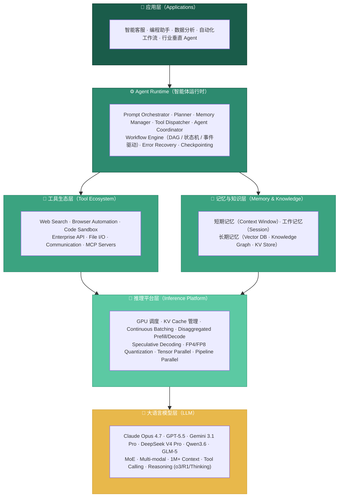

**图 1：五层架构总览 — 从 LLM 到应用层的分层体系**

**核心思想**：每一层只做一件事，做好一件事。各层之间通过标准化接口（MCP / A2A / REST / gRPC）通信。

| 层级 | 一句话本质 | 类比 |
|------|-----------|------|
| **LLM** | Token 概率预测与多步推理引擎 | 大脑皮层 |
| **推理平台** | 让 LLM 高效运行的加速层，Agent 负载原生优化 | 神经系统 |
| **Agent Runtime** | 编排思考与行动的协调层，管理状态与流程 | 操作系统内核 |
| **工具生态 / 记忆** | 与外部世界交互的执行层 + 经验存储层 | 手、眼、感官 + 记忆 |
| **应用层** | 面向最终用户的智能体应用 | 计算机程序 |

> **协议与安全骨架层**：MCP、A2A、Auth、Audit 贯穿上述五层，构成 Agent 系统的"血管与免疫系统"。

### 2.2 模型层（LLM）

#### 2.2.1 核心职责

LLM 的本质是一个**条件概率分布模型**：给定输入 Token 序列，预测下一个 Token 的概率分布。在 Agent 系统的语境下，其核心能力扩展为：

- **语言理解**：解析用户意图、理解上下文语义、从模糊指令中提取结构化信息
- **多步推理**：逻辑推理、数学计算、代码理解、因果分析
- **工具调用决策**：判断是否需要调用工具、选择正确工具、生成符合 Schema 的参数 JSON
- **计划生成**：将复杂任务分解为可执行的子步骤，支持 Plan-and-Execute 模式
- **多模态处理**（2025+ 标配）：图像、音频、视频的理解与生成
- **长上下文利用**：在 1M+ Token 窗口中定位与利用相关信息

#### 2.2.2 LLM 不负责的事情

这是一个常被误解的关键点：**LLM 本身不执行任何外部操作**。

- ❌ 不会联网搜索
- ❌ 不会操作浏览器或 GUI
- ❌ 不会访问数据库
- ❌ 不会执行代码
- ❌ 不会记住跨会话的信息

模型"认为"自己需要搜索时，它只是在生成一个 Tool Call 的 JSON——实际的搜索由下游系统执行。这是 Agent 架构分层的根本原因。

#### 2.2.3 推理时计算扩展（Test-Time Compute Scaling）

2025–2026 年最重要的架构变革之一，是从**训练时扩展**转向**推理时扩展**。

**传统范式**（GPT-4 时代）：
- 训练阶段消耗大量算力 → 得到一个固定的模型
- 推理阶段：一次前向传播 ≈ 固定成本
- 要提升推理质量 → 需要更大的模型

**新范式**（o3/o4-mini/DeepSeek-R1/Claude Thinking 时代）：
- 模型权重不变，但可以根据问题难度**动态分配推理 Token**
- 简单问题使用 System 1（快速响应，~1× Token）
- 复杂问题使用 System 2（深度思考，5–50× Token）
- 关键发现：小模型 + 更多推理时间可以超越大模型

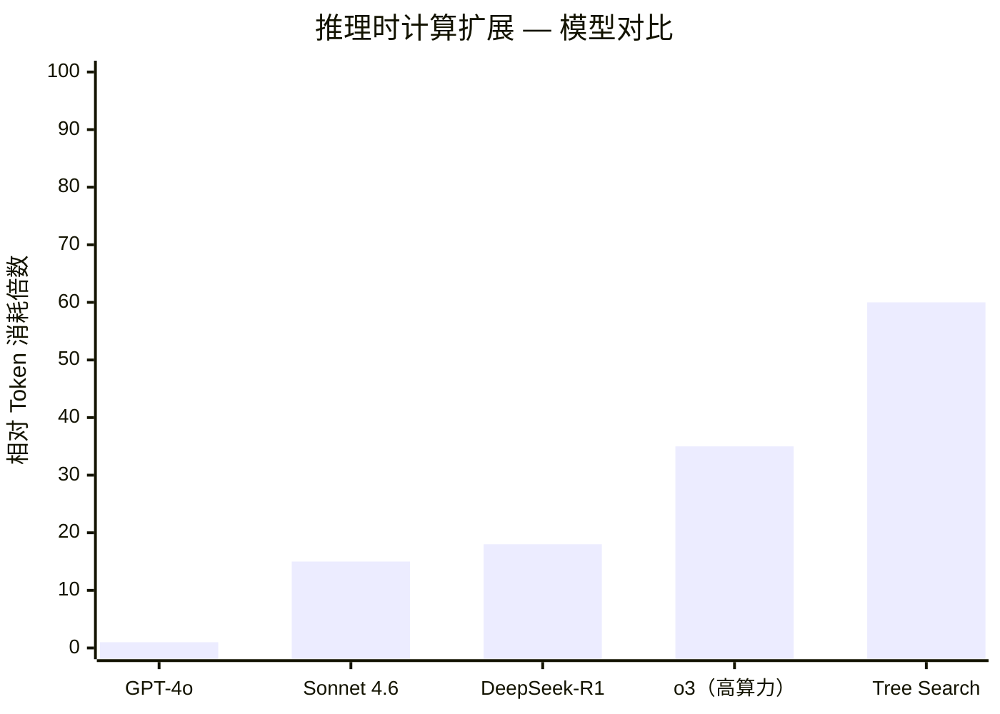

**图 2：推理时计算扩展对比 — 不同模型/策略的 Token 消耗倍数**

**基础设施影响**：

| 参数 | 典型值 | 说明 |
|------|--------|------|
| 单请求 KV Cache | ~9.8 GB @ 30K 推理 Token | 成为 GPU 显存瓶颈 |
| 最大推理 Token | o3 高算力模式可达 100K+ | 需要 H200/B200 级 GPU |
| GPU 需求转变 | HBM 带宽 > 算力（FLOPS） | 从"算得快"到"喂得饱" |
| 推荐硬件 | H200 (141GB, 4.8TB/s) / B200 (180GB, 7.7TB/s) | 高算力模式首选 |

**前沿研究洞察**（arXiv, 2026）：
- **"过度思考"（Overthinking）** 可能有害：如果训练数据缺乏相关技能的覆盖面，增加推理时计算反而会降低性能
- **技能多样性**：在多样化、相关且困难的任务上训练，能获得最佳的推理时扩展效果
- **小模型 + 更多思考**可以超越大模型：例如 7B 模型配合树搜索在 MATH 基准上超越 34B 模型

#### 2.2.4 前沿模型架构趋势

- **MoE（Mixture of Experts）**：DeepSeek V4 Pro（1.6T 总参数 / 49B 激活）、Kimi K2.6（1T 总参数 / 32B 激活 / 384 专家）通过稀疏激活大幅提升参数效率。MoE 路由器的设计质量直接影响下游任务表现
- **多模态原生**：所有 2026 旗舰模型（Claude Opus 4.7、GPT-5.5、Gemini 3.1 Pro）均原生支持文本 + 图像 + 音频
- **超长上下文**：1M–2M Token 上下文窗口已成为标配，Gemini 3.1 率先大规模商用 2M 上下文
- **推理专用模型系列**：o3/o4-mini、DeepSeek-R1（可见推理链，Open Source）、QwQ-32B、Claude Thinking（自适应思考）——通过 RLVR（Reinforcement Learning with Verifiable Rewards）训练范式实现涌现式推理能力

### 2.3 推理平台层（Inference Platform）

#### 2.3.1 核心职责

推理平台是连接 LLM 与上层应用的**性能加速层**。它不关心用户问什么，只关心如何尽快算出答案。2026 年的关键变革是推理平台从"通用 Chat 加速"演进为"Agent 负载原生优化"。

#### 2.3.2 关键技术演进

| 技术 | 作用 | 代表引擎 |
|------|------|---------|
| **PagedAttention** | KV Cache 分页管理，消除内存碎片 | vLLM |
| **Continuous Batching** | 动态批处理，提高 GPU 利用率 | 所有现代引擎 |
| **RadixAttention** | 前缀缓存树，多轮对话 + Agent 轨迹加速 | SGLang |
| **FlashInfer** | 高效注意力内核 | SGLang, vLLM |
| **Disaggregated Inference** | 分离 Prefill 和 Decode 到不同 GPU | NVIDIA Dynamo, vLLM |
| **Tensor Parallel** | 张量并行，跨 GPU 分片 | TensorRT-LLM, vLLM |
| **Speculative Decoding** | 投机解码，小模型草稿 + 大模型验证 | vLLM, TGI, Dynamo |
| **FP4/FP8 量化** | 低精度推理，降低显存需求 | TensorRT-LLM, Dynamo |
| **KV Cache 量化** | 将 KV Cache 从 FP16 压缩至 FP8/INT4 | 所有主流引擎 |

#### 2.3.3 主流推理引擎对比（2026）

| 维度 | vLLM | SGLang | TensorRT-LLM | NVIDIA Dynamo |
|------|------|--------|-------------|--------------|
| **社区规模** | ★★★★★ (~55K Stars) | ★★★★ (~12K Stars) | ★★★ (~10K Stars) | ★★ (新发布) |
| **原始吞吐** | ★★★★ | ★★★★★ | ★★★★★ | ★★★★★★ |
| **Agent 负载优化** | ★★★ | ★★★★★ | ★★★ | ★★★★★★ |
| **结构化输出** | ★★★ | ★★★★★ | ★★★ | ★★★★ |
| **离散推理** | ★★★ (2026 新增) | ★★ | ★★★★ | ★★★★★ (原生) |
| **硬件兼容** | NVIDIA + AMD + Intel | 主要 NVIDIA | NVIDIA Only | NVIDIA Only |
| **部署难度** | ★★★★ | ★★★★ | ★★ | ★★★ |
| **最佳场景** | 通用生产部署 | Agent / 结构化输出 | Blackwell 极致性能 | Agent 原生负载 |

**NVIDIA Dynamo（GTC 2026 发布）**：
Dynamo 是专为 Agent 工作负载重新设计的推理架构，核心创新包括：
- **离散推理（Disaggregated Inference）**：将 Prefill 和 Decode 阶段分离到不同 GPU 上，消除两阶段资源争用
- **Agent 运行时嵌入**：将 Agentic Client 直接内置于 Dynamo 中，最小化往返延迟
- **模型路由**：在多个能力模型之间智能路由请求
- **沙箱内工具执行**：在推理平台内执行沙箱化的工具调用

**选型建议**：
- **大多数团队**：从 vLLM 开始，社区成熟、功能全面
- **Agent/工具调用密集**：SGLang，RadixAttention + Constrained Decoding 带来 15–30% 优势
- **极致性能/NVIDIA 全栈**：Dynamo（新项目）或 TensorRT-LLM（存量），但需要 CUDA 工程能力

#### 2.3.4 推理平台不负责的事情

- ❌ 不处理 Tool Calling 逻辑
- ❌ 不管理 Agent Workflow
- ❌ 不执行 Web Search
- ❌ 不维护会话 Memory

### 2.4 Agent Runtime 层（智能体运行时）

#### 2.4.1 核心职责

Agent Runtime 是整个系统中的**"操作系统"**——它负责协调"思考"（LLM）与"行动"（工具），管理状态与流程，处理错误恢复与安全检查。2026 年的 Agent Runtime 不仅仅是编排层，更是智能体系统的可靠性基石。

#### 2.4.2 核心组件

| 组件 | 职责 | 关键技术 |
|------|------|---------|
| **Prompt Orchestrator** | 系统提示词管理、上下文拼接、多轮对话维护、Progressive Tool Discovery | Prompt 模板引擎、动态指令注入、上下文预算管理 |
| **Planner** | 任务分解、步骤编排、路径规划、动态重计划 | ReAct、Plan-and-Execute、Tree-of-Thought、RePlan |
| **Tool Dispatcher** | 工具调用调度、参数校验、结果解析、并发控制 | MCP Client、Function Calling Schema、Rate Limiter |
| **Memory Manager** | 短期/长期记忆管理、记忆压缩、检索、遗忘 | RAG、Vector DB、Knowledge Graph、Mem0 |
| **Workflow Engine** | 多步工作流编排、条件分支、循环、并行、超时 | DAG、状态机、事件驱动、Saga 模式 |
| **Agent Coordinator** | 多 Agent 通信与协调 | A2A Protocol、Message Queue、Task Broker |
| **Error Recovery** | 错误检测、自动重试、降级策略、回滚 | Circuit Breaker、Retry with Backoff、Fallback |
| **Checkpoint & State** | 持久化 Agent 状态、断点续传、快照 | State Store (Redis/PG)、Snapshot、WAL |

#### 2.4.3 Agent Runtime 的标准流程

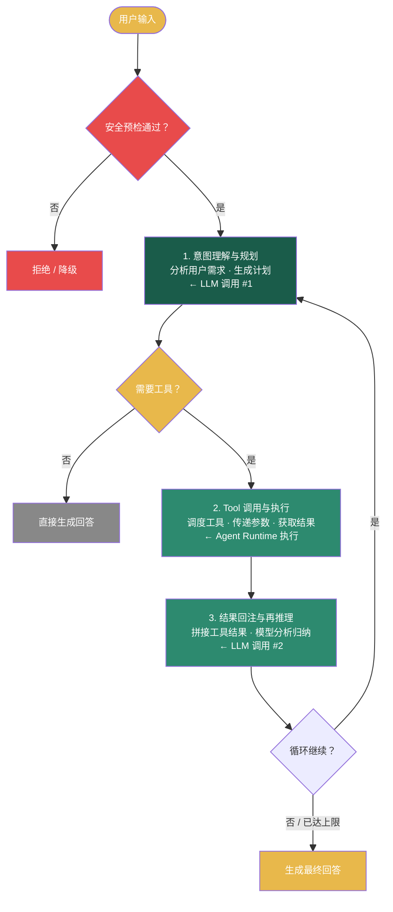

**图 3：Agent Runtime 标准流程 — 安全预检 → 意图理解 → Tool 调用 → 结果回注 → 最终回答**

**工程实现要点**：
- 逻辑上是串行的（思考 → 行动 → 再思考），但工程实现高度并行
- 安全检查（越狱检测、PII 过滤、内容审核）与 LLM 推理并行执行
- 多搜索源并行（Google + Bing + 内部知识库）
- 多工具并行调用（通过 DAG 分析依赖关系）
- Streaming 下模型生成与前端接收并行
- 循环保护：最大迭代次数限制（通常 10–25 轮）+ 时间超时

#### 2.4.4 Agent Runtime 的实现形态

2026 年的 Agent Runtime 主要有三种实现路径：

| 形态 | 代表实现 | 优势 | 劣势 |
|------|---------|------|------|
| **嵌入式 Runtime** | LangGraph、CrewAI、AG2 | 灵活、可定制、本地控制 | 需要自行管理状态和扩展 |
| **平台级 Runtime** | OpenAI Responses API、Google Vertex AI Agent Runtime、Azure AI Agent | 托管、高可用、内置安全 | 厂商锁定、灵活性有限 |
| **协议化 Runtime** | MCP + A2A 分布式运行时 | 去中心化、互操作、开放 | 延迟增加、调试复杂 |

**推荐策略**：原型阶段使用嵌入式 Runtime 快速迭代，生产部署时评估平台级 Runtime 降低运维成本，需要跨组织协作时采用协议化 Runtime。

---

## 第三章 推理平台深度解析

### 3.1 推理引擎核心技术

#### 3.1.1 PagedAttention 与 KV Cache 管理

KV Cache 是大模型推理中的核心显存消耗源。以 70B 参数模型为例，单请求 30K 推理 Token 约需 9.8GB 显存。PagedAttention 借鉴操作系统分页机制，将 KV Cache 分页管理：

- **非连续显存分配**：消除碎片化
- **页面共享**：同一 Prompt 前缀的多个请求共享 KV Cache 页面
- **Copy-on-Write**：分割请求场景下的高效显存复用

#### 3.1.2 Continuous Batching 的演进

从静态批处理到连续批处理的演进彻底改变了推理吞吐：

- **静态批处理**：收集足够请求后才开始推理 → GPU 利用率低谷
- **连续批处理**：请求完成后立即插入新请求到正在进行的批次中 → 接近满利用率

2026 年的 Continuous Batching 针对 Agent 工作负载专门优化：
- **Agent 轨迹感知**：工具调用返回结果后，新生成的 Token 批次优先级高于纯生成批次
- **优先级队列**：交互式 Agent 请求（低延迟需求）与后台处理（高吞吐需求）分队列调度

#### 3.1.3 RadixAttention 与结构前缀缓存

SGLang 的 RadixAttention 利用 Agent 工作负载的结构化特性：
- 工具调用 → 观察结果 → 继续生成的循环产生大量重复前缀
- Radix Tree 结构实现跨请求的 KV Cache 复用
- Agent 场景下实测降低 Prefill 延迟 15–30%

### 3.2 Agent 负载的推理优化

#### 3.2.1 Tool Call 结构化输出

Agent 场景对结构化输出有极高要求（Tool Call JSON 必须完全符合 Schema）：

| 方法 | 延迟 | 可靠性 | 引擎支持 |
|------|------|--------|---------|
| **JSON Mode** | 低 | 中 | vLLM、TGI |
| **Constrained Decoding**（正则约束） | 中 | 高 | SGLang（原生）、vLLM（XGrammar） |
| **Grammar-based Decoding**（BNF 文法） | 中高 | 极高 | SGLang、Outlines |
| **Function Calling Native** | 低 | 高 | 专有 API（OpenAI、Anthropic） |

**建议**：工具调用密集的 Agent 系统选择 SGLang 的 Constrained Decoding，系统延迟降低 20–40%。

#### 3.2.2 上下文预算管理

Agent 系统面临严重的上下文窗口压力：
- 系统提示词（2K–10K tokens）
- 工具描述（每个 200–1K tokens × 15–20 工具 = 3K–20K tokens）
- 历史对话（每轮 500–2K tokens × 多轮 = 10K–50K tokens）
- 推理链（每步 500–2K tokens × 5–20 步 = 2.5K–40K tokens）

**Progressive Tool Discovery**（2026 关键技术）：工具描述分页加载，仅在需要时才将工具描述注入 Prompt。Claude Code 的实现显示，这减少 **~85%** 的工具描述 Token 消耗。

### 3.3 推理引擎选型雷达

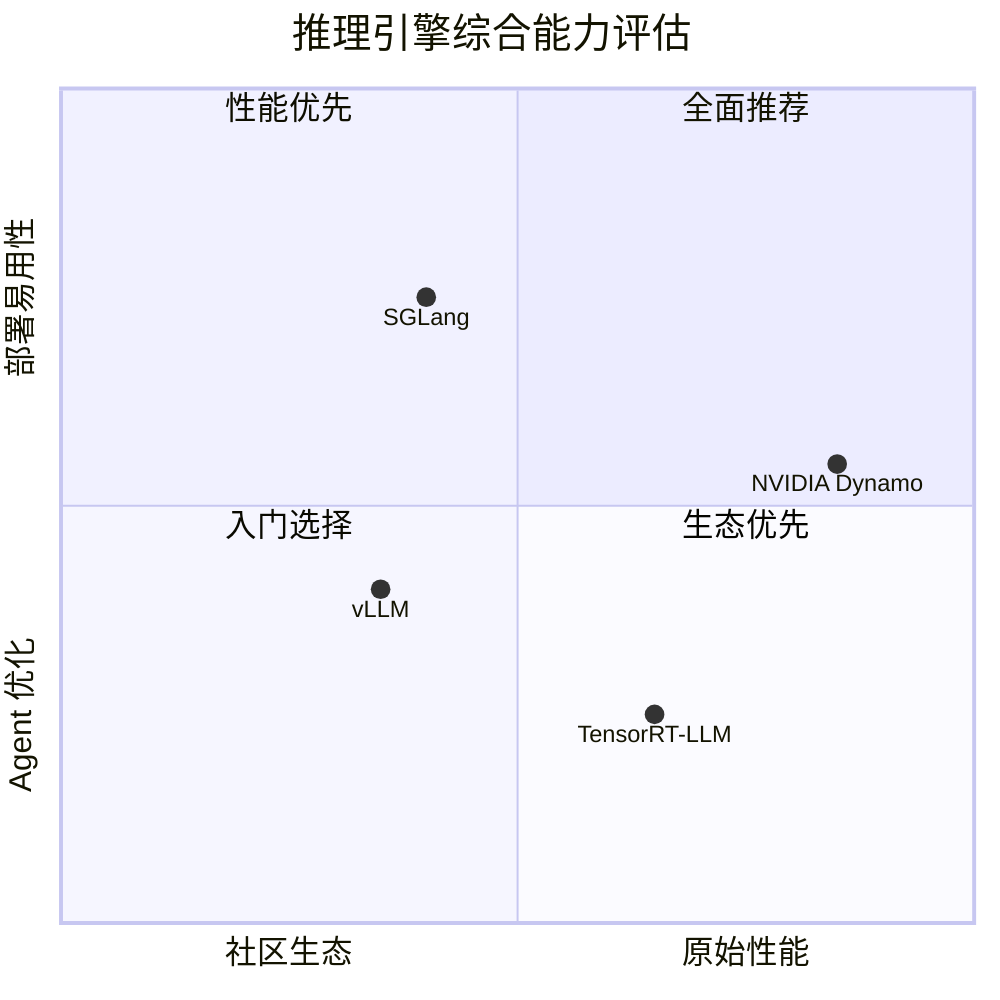

**图 4：推理引擎综合能力评估四象限图**

### 3.4 推理平台选型决策

| 场景 | 推荐引擎 | 理由 |
|------|---------|------|
| 通用 Agent 生产部署 | vLLM | 社区最大、硬件兼容最广、功能全面 |
| Agent + 结构化输出密集 | SGLang | RadixAttention + Constrained Decoding |
| 极致性能 / 全栈 NVIDIA | NVIDIA Dynamo | 离散推理原生、Agent Runtime 集成 |
| 存量 Blackwell 部署 | TensorRT-LLM | 深度硬件优化、FP4 支持 |
| 自建推理 | SGLang | 最易扩展、架构清晰 |

---

## 第四章 Agent Runtime 与记忆系统

### 4.1 Agent Runtime 核心组件详解

#### 4.1.1 Prompt Orchestrator（提示编排器）

Prompt Orchestrator 是 Agent Runtime 中的"隐形建筑师"——它负责构建 LLM 看到的完整上下文。2026 年的 Prompt 编排已从简单的字符串拼接发展为智能上下文管理系统。

**核心职责**：

| 功能 | 说明 | 工程挑战 |
|------|------|---------|
| **系统提示管理** | 加载基础系统提示、注入动态指令、拼接角色设定 | 提示版本管理、A/B 测试 |
| **上下文预算分配** | 在系统提示、工具描述、历史记录、推理链之间分配 Token 预算 | 动态调整、优先级策略 |
| **Progressive Tool Discovery** | 按需分页加载工具描述，避免上下文浪费 | 工具相关性预测、加载策略 |
| **历史管理** | 多轮对话维护、滑动窗口裁剪、摘要压缩 | 信息损失控制、压缩策略 |
| **动态指令注入** | 根据用户身份、权限、上下文注入策略指令 | 安全隔离、优先级 |

#### 4.1.2 Planner（规划器）

Planner 负责将用户意图转化为可执行的步骤序列。2026 年的 Planner 从"单次规划 → 执行"演进为"持续规划 → 动态调整"。

**规划策略谱系**：

```
┌─────────────────────────────────────────────────────────────────┐
│                    规划策略复杂度谱系                              │
├───────────┬───────────┬───────────┬───────────┬──────────────────┤
│  Zero-shot │  ReAct    │ Plan-and- │ Tree-of-  │ MCTS / Monte     │
│  (无规划)  │  (逐步)   │  Execute  │  Thought  │  Carlo Tree 搜索  │
├───────────┼───────────┼───────────┼───────────┼──────────────────┤
│  最简单    │   较简单   │   中等     │   复杂     │  最复杂           │
│  无规划    │  逐步推理  │  先计划后  │  多路径     │  探索-利用        │
│            │          │   执行     │  并行探索   │  平衡            │
├───────────┼───────────┼───────────┼───────────┼──────────────────┤
│  简单任务  │  工具调用  │  多步工作流 │  创意/推理  │  棋牌/优化       │
│            │          │           │   类任务   │  类问题          │
└───────────┴───────────┴───────────┴───────────┴──────────────────┘
```

**图 5：规划策略复杂度谱系**

**关键工程实践**：
- **Plan-Ahead**：LLM 首轮调用即生成完整计划，随后逐步骤执行，而非每次 ReAct 循环都从零开始决策
- **RePlan**：当工具返回结果与预期不符时，触发重规划而非盲目继续
- **最大步骤限制**：硬性限制（通常 10–25 步）防止无限循环
- **Checkpoint 回滚**：失败时回滚到最近的有效检查点而非从头开始

#### 4.1.3 Memory Manager（记忆管理器）

2026 年最重要的 Agent Runtime 组件之一。记忆系统直接影响 Agent 的个性一致性、事实准确性和长期可用性。

### 4.2 记忆分层架构

现代 Agent 的记忆系统借鉴人类记忆理论，采用**多层次分层架构**：

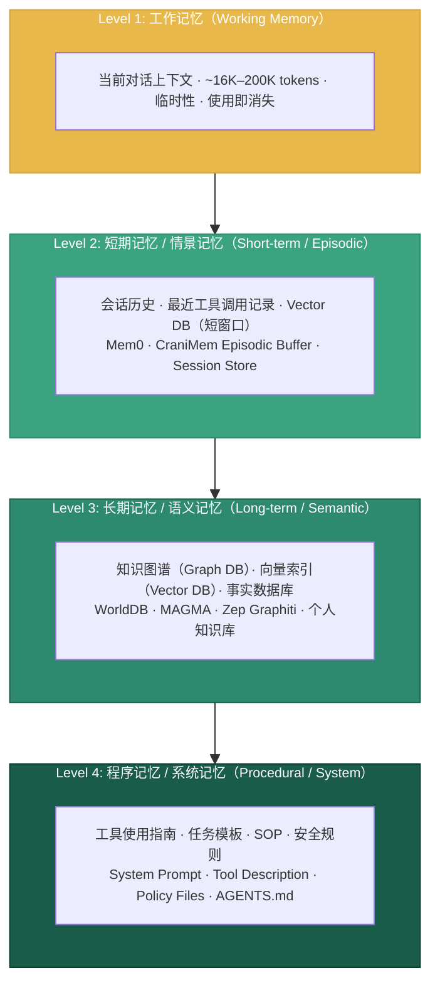

**图 6：Agent 记忆分层架构 — 从工作记忆到程序记忆的四层体系**

#### 4.2.1 层级设计原则

| 层级 | 存储介质 | 容量 | 持久性 | 检索延迟 | 管理策略 |
|------|---------|------|--------|---------|---------|
| **工作记忆** | Context Window | 16K–2M tokens | 请求级 | < 1ms | FIFO / 滑动窗口 |
| **短期记忆** | Vector DB / Session Store | 1K–10K 条目 | 会话级 | 10–50ms | 摘要压缩、过期淘汰 |
| **长期记忆** | Graph DB / KV Store | 无上限 | 持久 | 20–200ms | 巩固、索引、MRR 排序 |
| **程序记忆** | 配置文件 / Prompt | 10–100 条目 | 永久 | < 1ms | 版本管理、A/B 测试 |

#### 4.2.2 前沿记忆研究（2026）

**WorldDB**（arXiv, April 2026）：
- 内容寻址的不可变节点（"Worlds"）加递归子图
- 写入时触发器边缘处理器（`on_insert`/`on_delete`/`on_query_rewrite`）
- LongMemEval-S 基准测试：**96.40%**（vs Hydra DB 90.79%, Supermemory 85.20%）
- 核心创新：边（Edges）是行为程序而非标签——支持替代、矛盾处理和合并提议

**MAGMA**（ACL 2026 Main）：
- 四重正交图结构：语义图 / 时间图 / 因果图 / 实体图
- 检索策略：基于策略的图遍历，而非简单相似度搜索
- LoCoMo 和 LongMemEval 上超越 SOTA
- 核心洞见：将记忆表示与检索逻辑解耦，实现透明推理

**CraniMem**（ICLR 2026 Workshop）：
- 双存储架构：情景缓冲区 + 长期知识图谱
- 目标条件化写入门控（Goal-conditioned Utility Gate）控制写入
- 定时整合清理低效用项目（Scheduled Consolidation）
- 在噪声/干扰条件下比 RAG 和 Mem0 更鲁棒

**Mem0**（生产级持久记忆层）：
- 多级记忆：User / Session / Agent
- 显式操作原语：ADD / UPDATE / DELETE / NOOP
- 对比 OpenAI Memory：准确度高 26%，延迟低 91%，Token 节省 90%
- LangGraph 深度集成

#### 4.2.3 检索增强生成（RAG）vs 图检索

| 维度 | Vector RAG | Graph RAG | 混合（Vector + Graph） |
|------|-----------|-----------|----------------------|
| **最佳场景** | 非结构化数据、模糊匹配 | 结构化关系、多跳推理 | 复杂知识密集型任务 |
| **查询类型** | "找到与 X 相似的概念" | "X 和 Y 如何确切关联？" | 先模糊搜索后精确推理 |
| **构建成本** | 低 | 高（本体设计、实体提取） | 中高 |
| **精度** | 相似度好，精确性一般 | 显示关系精度高 | 最优 |
| **冷启动** | 即时可用 | 需要预填充 | 部分预填充 |
| **2026 趋势** | 标准配置 | 知识图谱 + Agent 记忆 | **主流推荐** |

### 4.3 工具调度引擎

#### 4.3.1 工具注册与发现

工具调度引擎的核心挑战：在大规模工具集中快速、准确地选择正确工具。

**工具注册三要素**：
1. **工具名**：唯一标识，命名空间化管理
2. **JSON Schema**：参数结构的精确描述（OpenAPI / JSON Schema 兼容）
3. **自然语言描述**：辅助 LLM 理解工具用途的文本（直接影响选择准确率）

**工具选择准确率 vs 工具数量**：
- < 10 个工具：选择准确率 > 95%
- 15–20 个工具：选择准确率 85–90%
- > 25 个工具：选择准确率显著下降至 < 80%
- 解决方案：分层工具目录 + Progressive Discovery

#### 4.3.2 工具调用的并发与协调

Agent Runtime 的 Tool Dispatcher 需要处理以下复杂场景：

| 场景 | 策略 | 实现 |
|------|------|------|
| **并行工具调用** | 无依赖关系的工具同时执行 | 异步 / 协程池 |
| **链式工具调用** | B 的输入依赖 A 的输出 | DAG 调度器 |
| **条件工具调用** | 根据 A 的结果决定是否调用 B | 条件分支 / 决策节点 |
| **竞争工具调用** | 多个工具返回相同类型结果 | 投票 / 置信度排序 |
| **超时控制** | 工具执行超时处理 | 每个工具独立超时 + 全局超时 |
| **重试策略** | 临时故障自动重试 | Exponential Backoff + Jitter |

#### 4.3.3 工具安全

工具层是企业部署 Agent 时**最大的攻击面**。详见第7章的安全治理分析。

---

## 第五章 智能体架构模式

### 5.1 模式选择的基本原则

2026 年的行业共识可以用一句话概括：**"大多数团队过早引入多 Agent。如果一个带工具调用的单 Agent 能解决问题，那就是正确答案。"**

Google Research 对 180 种配置的评估（2026 年 1 月）提供了关键证据：

| 任务类型 | 最佳架构 | 性能影响 |
|---------|---------|---------|
| **可并行任务**（如金融推理） | 集中式多 Agent | **+80.9%** vs 单 Agent |
| **顺序任务**（如计划） | 单 Agent | 多 Agent **下降 39–70%** |
| **高工具密度**（16+ 工具） | 单 Agent | 多 Agent "协调税"超过收益 |

**关键结论**："更多 Agent 并不总是更好"——多 Agent 协调在独立设置中放大错误达 **17.2 倍**（vs 集中式的 4.4 倍）。Google 开发的预测模型可在 **87% 的未见任务**中识别最优架构。

### 5.2 单 Agent 模式

#### 5.2.1 ReAct 循环

单 Agent 模式是最简单、最可靠的架构。其核心是 **ReAct（Reasoning + Acting）循环**：

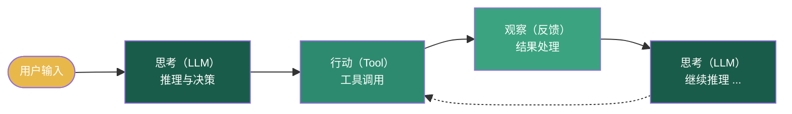

**图 7：ReAct 基础循环 — 思考 → 行动 → 观察的迭代模式**

#### 5.2.2 何时使用单 Agent

- 任务范围明确，不需要多角色协作
- 工具集在 15–20 个以内
- 对延迟敏感，希望避免多 Agent 的协调开销
- 项目早期，先跑通核心流程

#### 5.2.3 单 Agent 的局限

| 局限 | 现象 | 触发阈值 |
|------|------|---------|
| **上下文过载** | 工具描述 + 历史记录超出有效注意力范围 | > 20 个工具 或 > 10 轮交互 |
| **角色冲突** | 同一 Agent 难以兼顾代码生成和安全审查 | 需要对立角色的场景 |
| **工具选择噪声** | 工具越多，LLM 选择准确率越低 | > 15–20 个工具 |
| **顺序瓶颈** | 串行处理限制可扩展性 | 存在独立子任务 |

### 5.3 多 Agent 编排模式

#### 5.3.1 Supervisor/Worker（中央协调模式）

**架构**：一个中心 Supervisor Agent 接收任务，分解为子任务，路由给 Worker Agent，汇总结果。

**2026 年生产级实证数据**：

| 指标 | Supervisor | Swarm |
|------|-----------|-------|
| 平均延迟（需要交办时） | ~9.1s | ~5.4s |
| LLM 调用数（多域任务） | 4 次 | 2 次 |
| 路由准确率 | 94% | 91% |

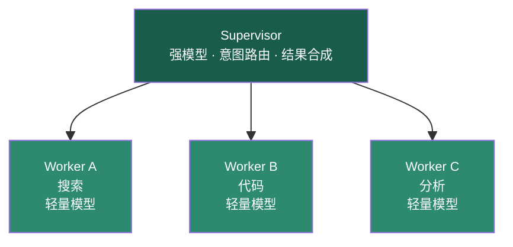

**图 8：Supervisor/Worker 中央协调模式**

**使用场景**：客服系统（Supervisor 分派给搜索、退款、投诉等专业 Agent）
**风险**：Supervisor 成为瓶颈；任务分解错误导致下游级联
**变体**：Supervisor 也参与部分子任务（轻量级）、Supervisor 仅路由不处理（纯路由）

#### 5.3.2 Pipeline（流水线模式）

**架构**：线性链式处理，每步 Agent 对中间结果进行转换。

**核心特征**：
- 明确的输入/输出接口
- 可在节点间插入验证门控
- 易于理解、调试、监控

**适用场景**：内容生成管线（研究 → 写作 → 编辑 → 格式化）、ETL 处理、代码审查流程

**风险**：错误级联——前一节点出错影响后续全部。每一步增加误导信息风险。

**典型案例**：Cognition（Devin）的代码生成-审查分离模式——一个 Agent 写代码，**独立 Agent 用干净上下文**进行审查。平均每次 PR 捕获 2 个 bug，58% 被分类为严重。

#### 5.3.3 Swarm（点对点模式）

**架构**：无中心协调器，Agent 之间直接通信、委托任务。

**核心机制**：`handoff`——Agent 判断自己不再适合处理当前状态，将控制权 + 会话上下文转移给另一个 Agent。

**适用场景**：开放式协作、不可预测的对话流、研究探索

**风险**：无限循环（Agent A → B → A → ...）。缓解：**最大跳转深度限制**（通常 3–5 跳）。

**工具支持**：OpenAI Swarm（原型）、LangGraph（`add_node` + `add_conditional_edges`）、CrewAI（`process=Process.hierarchical` 变体）

#### 5.3.4 层次化编排（Hierarchical）

**架构**：多级 Supervisor 形成树状管理结构。顶层 Supervisor 将大型任务分解为多个子域，每个子域由专门的 Supervisor 管理。

```
                     ┌─────────────────────┐
                     │   Top Supervisor     │
                     │  (战略规划 · 跨域)    │
                     └──────────┬──────────┘
                                │
               ┌────────────────┼────────────────┐
               │                │                │
      ┌────────▼────────┐  ┌───▼────────┐  ┌────▼───────┐
      │ Research Sup.   │  │ Write Sup. │  │ Review Sup.│
      │ (搜索 · 分析)    │  │ (生成 · 编辑)│  │ (审查 · 测试)│
      └──┬────┬────┬───┘  └───┬────┬───┘  └────┬───┬───┘
         │    │    │          │    │           │   │
         ▼    ▼    ▼          ▼    ▼           ▼   ▼
        Web  Doc  Data      Draft Editor      Test Code
       Search Ana  Viz      Writer            Review Coverage
```

**图 9：层次化编排架构**

**适用场景**：跨周/跨多 PR 的大型项目、复合分析报告、多部门协作的企业级 Agent 部署

**风险**：层次间总结信息损耗，上下文不一致性

### 5.4 架构模式决策框架

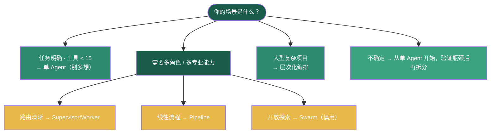

**图 10：架构模式决策树**

### 5.5 2026 年多 Agent 编排的关键趋势

1. **从"更多 Agent"到"更少但更优的 Agent"**：行业从追逐 Agent 数量转向关注编排质量
2. **上下文不一致是编排失败的首要原因**：比模式选择错误更常见
3. **模式组合成为主流**：最成功的部署使用组合模式（层次化 + 流水线子团队）
4. **A2A 协议使跨框架编排成为现实**：LangGraph 的 Agent 可以通过 A2A 与 CrewAI 的 Agent 通信
5. **成本规划**：多 Agent 预算通常为单 Agent 的 3–5 倍，通过 Worker 使用廉价模型抵消

---

## 第六章 开放协议体系

2025–2026 年间，AI Agent 领域最重要的基础设施进展是**开放协议的标准化**。两个协议占据了核心位置：**MCP（Model Context Protocol）** 和 **A2A（Agent-to-Agent Protocol）**。它们不是竞争关系，而是互补关系——分别解决了 Agent 系统中的两个根本问题：

- **MCP**：Agent ⟷ 工具/数据（垂直集成）
- **A2A**：Agent ⟷ Agent（水平协调）

2025 年 12 月，两个协议在 Linux Foundation 下属的 **Agentic AI Foundation（AAIF）** 下统一治理。AAIF 已拥有 100+ 成员组织，覆盖 Platinum、Gold、Silver 级别。

### 6.1 MCP（Model Context Protocol）深度解析

#### 6.1.1 协议架构

MCP 的核心设计是 Client-Server 模式，采用 JSON-RPC 2.0 作为消息协议：

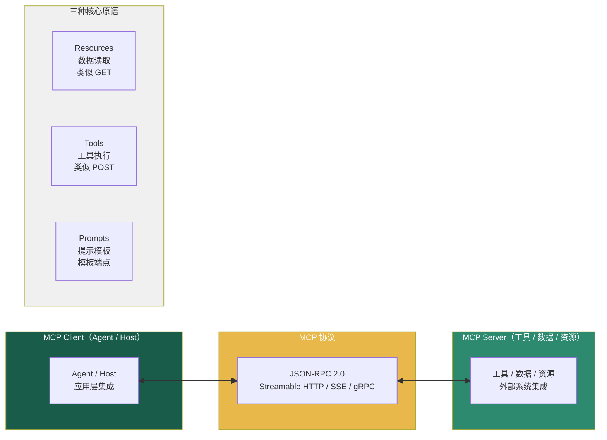

**图 11：MCP 协议架构 — Client-Server 模式与三种核心原语**

**三种核心原语**：

| 原语 | 方向 | 说明 | 类比 HTTP |
|------|------|------|-----------|
| **Resources** | Server → Client | 数据资源的发现与读取 | GET |
| **Tools** | Client → Server | 工具的执行调用 | POST |
| **Prompts** | Server → Client | 预定义的提示模板 | 模板端点 |

#### 6.1.2 2025–2026 关键里程碑

| 时间 | 事件 | 意义 |
|------|------|------|
| 2024.11 | Anthropic 发布 MCP 规范 | 首次定义协议 |
| 2025.03 | MCP 移交 Linux Foundation | 治理中立化 |
| 2025.07 | 首届 MCP Dev Summit | 社区确立 |
| 2025.12 | Agentic AI Foundation（AAIF）成立 | MCP + A2A 统一治理 |
| 2026.01 | MCP Apps 发布 | 扩展支持交互式 UI |
| 2026.04 | MCP Dev Summit NA 2026（NYC, 1,200+ 参会者） | 网关模式成为企业架构共识 |
| 2026 ongoing | Streamable HTTP、OAuth、Tasks 原语 | 企业级能力补全 |

#### 6.1.3 传输层演进

| 传输协议 | 发起方 | 优势 | 状态 |
|---------|--------|------|------|
| **HTTP + SSE**（原始标准） | MCP 项目 | 简单、广泛兼容 | 稳定 |
| **Streamable HTTP** | MCP 项目 | 无状态、负载均衡支持 | **2026 推荐** |
| **gRPC** | Google Cloud | 低带宽、强类型（.proto） | 预览 |
| **MOQT（Media Over QUIC）** | Cisco + Google | 无队头阻塞、优先级感知 | IETF Draft |

#### 6.1.4 MCP Apps（2026 年 1 月发布）

MCP 首个官方扩展，使 Server 可以声明 UI 资源（HTML/CSS/JS）并通过沙箱化 iframe 渲染。双向通信通过 `postMessage` + JSON-RPC 实现。

**已采用**：Claude、ChatGPT、VS Code（GitHub Copilot）、Goose、Postman、MCPJam

#### 6.1.5 企业级特性

**Gateway + Registry 架构（2026 年共识架构）**：

| 组件 | 职责 | 代表实现 |
|------|------|---------|
| **MCP Gateway** | 集中控制平面，代理所有 MCP 请求 | Uber GenAI Gateway、AWS Bedrock |
| **MCP Registry** | 服务目录，自动发现和注册 | Docker、Kong、Solo.io |
| **MCP Auth** | OAuth、API Key、mTLS | AAIF 标准化中 |
| **MCP Audit** | 全量审计日志 | OpenTelemetry 集成 |

**生产案例—Uber MCP 平台**：
- 运行**每周数万次** Agent 执行
- MCP Gateway 自动将数千个内部 Thrift/Protobuf/HTTP 端点暴露为 MCP 工具
- Go 编写的 GenAI Gateway 执行 PII 编辑和内部标识符清洗

#### 6.1.6 MCP 安全挑战

2026 年 4 月，安全研究者披露了 MCP 的 **"设计缺陷"（By-Design Flaw）**：

- **问题本质**：MCP 的信任模型允许任何一个被攻破的连接器**横向移动**到同一 Agent 连接的所有其他工具
- **影响规模**：20 万+ MCP 服务器可能受到影响
- **行业回应**：信任模型需要重构，而非简单补丁

对此，学术研究（MDPI Future Internet, 2026）提出了**三层 MCP 注册表安全架构**：

| 层次 | 技术 | 作用 |
|------|------|------|
| Layer 1 | RFC 8615 Well-Known URIs | 去中心化服务器发现 |
| Layer 2 | Sigstore Keyless Signing | 绑定服务器构件到可审计的 CI/CD |
| Layer 3 | JCS/JWS（RFC 8785） | 实时能力更新的确定性消息完整性 |

实验表明：每次签名增加约 **0.61ms** 的加密开销，可 **100%** 阻止模拟的"Rug Pull"攻击（动态能力篡改）。

### 6.2 A2A（Agent-to-Agent Protocol）深度解析

#### 6.2.1 协议定位

A2A 由 Google 于 2025 年 4 月在 Google Cloud Next 上发布，2025 年 6 月捐赠给 Linux Foundation。截至 2026 年 4 月，已获得 **150+ 组织**背书，深度集成于 Google Vertex AI / Agentspace、Microsoft Azure AI Foundry、AWS Bedrock AgentCore。

**核心设计目标**：让不同厂商、不同框架构建的 Agent 能够相互发现、委托任务、协调工作——而不暴露内部逻辑、记忆或实现细节。

#### 6.2.2 核心概念

| 概念 | 说明 |
|------|------|
| **Agent Card** | 位于 `/.well-known/agent-card.json` 的 JSON 文档，声明 Agent 的能力、认证要求和端点 |
| **Task** | 有状态的执行单元，生命周期：`submitted → working → input-required → completed / failed / canceled / rejected` |
| **Transport** | HTTP + JSON-RPC 2.0 + SSE + Webhook |
| **Security** | OAuth 2.0、API Key、OpenID Connect、JWS 签名的 Agent Card |

#### 6.2.3 交互流程

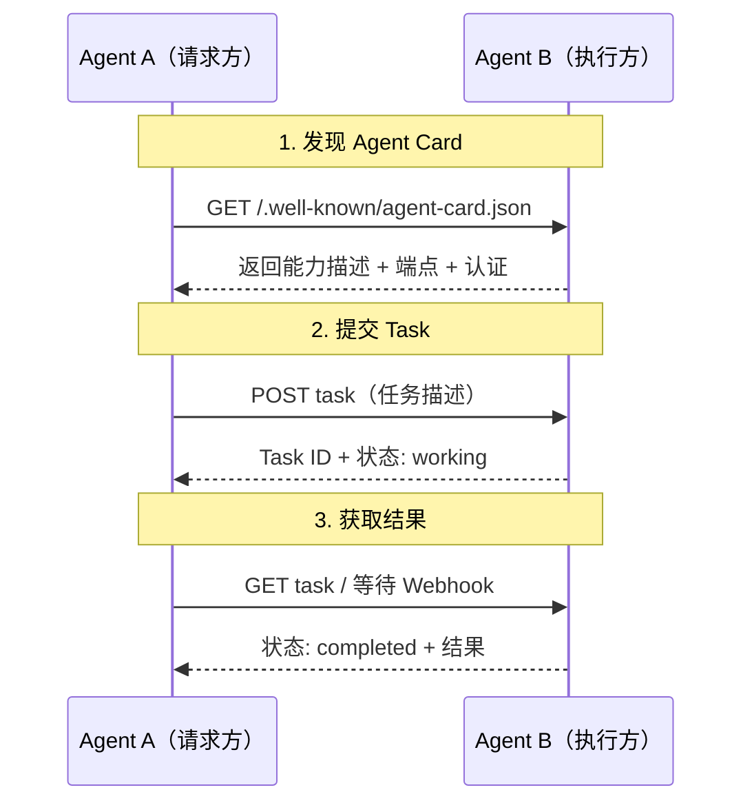

**图 12：A2A 核心交互流程**

#### 6.2.4 A2A SDK 实现（Google ADK）

```python
# Google Agent Development Kit — A2A 远程 Agent 调用示例
from google.adk import Agent, RemoteA2aAgent

researcher = RemoteA2aAgent(
    name="researcher",
    agent_card="http://researcher-service:8000/.well-known/agent-card.json",
    description="在互联网上搜索并汇总信息。"
)

judge = RemoteA2aAgent(
    name="judge",
    agent_card="http://judge-service:8000/.well-known/agent-card.json",
    description="评估信息的准确性和相关性。"
)

orchestrator = Agent(
    name="orchestrator",
    model="gemini-3.1-pro",
    tools=[researcher, judge]
)
```

Google ADK 提供 **Python、Go、Java、TypeScript** 四种语言的 SDK，代码优先、模型无关，可部署到任何容器或 Kubernetes 环境。

### 6.3 MCP + A2A 互补关系

| 维度 | MCP | A2A |
|------|-----|-----|
| **问题** | Agent 如何调用工具/数据？ | Agent 如何与 Agent 协作？ |
| **类比** | USB-C（设备连接标准） | TCP/IP（网络通信协议） |
| **关系** | 垂直集成 | 水平协调 |
| **消息模式** | Client ↔ Server | Peer ↔ Peer |
| **生命周期** | 无状态 / 流式 | 有状态 Task |
| **发现机制** | 手动配置 / Registry | Agent Card（.well-known） |
| **安全焦点** | 工具级授权 | Agent 级身份认证 |
| **治理组织** | AAIF (Linux Foundation) | AAIF (Linux Foundation) |

**典型调用链**：

```
用户 → Agent A (通过 MCP 使用工具) → A2A → Agent B (通过 MCP 使用专用工具)
```

**2026 年生态融合**：
- CrewAI 已实现 A2A 适配器，可以调用任意 A2A-compatible Agent
- LangGraph 节点可以通过 MCP Server 暴露为 A2A Agent
- Microsoft Agent Framework 同时支持 MCP（工具）和 A2A（Agent 间通信）

---

## 第七章 企业级生产化与安全治理

AI Agent 从原型到生产环境的跨越，是 2026 年行业面临的最大挑战。据统计，**88% 的企业 AI Agent 试点从未进入生产环境**（Northflank, 2026），而 Gartner 预测到 2027 年超过 **40% 的 Agentic AI 项目**将因风险控制不足而被取消。

根本原因在于：**Chatbot 出错只是答错，Agent 出错可以造成真实世界的损失。**

### 7.1 OWASP Agentic Top 10（2026）

2025 年 12 月，OWASP 发布首个针对 **Agentic Applications** 的安全风险框架，区别于 2025 年的 LLM Top 10。核心差异：

| 维度 | LLM Top 10（2025） | Agentic Top 10（2026） |
|------|-------------------|----------------------|
| **范围** | 静态聊天机器人、Q&A | 自主智能体、工具调用、多步工作流 |
| **失效模式** | 错误输出 | 错误行为（操作级失效） |
| **新增风险** | — | 内部 Agent 通信、级联故障、失控 Agent |
| **供应链** | 静态、部署前 | 动态、运行时组合 |
| **记忆风险** | 单轮上下文 | 跨会话持久投毒 |
| **身份** | 人类中心 | Agent 级 IAM + 委托链 |

#### 十大风险（ASI01–ASI10）

| ID | 风险 | 严重度 | 核心问题 |
|----|------|--------|---------|
| **ASI01** | Agent 目标劫持 | **严重** | 通过 Prompt 注入篡改 Agent 决策链路 |
| **ASI02** | 工具滥用与利用 | 高 | 合法工具被引导用于非预期用途 |
| **ASI03** | 身份与权限滥用 | 高 | 委托链权限升级、不可追踪行为 |
| **ASI04** | 供应链漏洞 | **严重** | MCP 服务器 / 插件 / Prompt 模板运行时篡改 |
| **ASI05** | 意料之外的代码执行（RCE） | **严重** | Shell 命令 / eval / 未授权包安装 |
| **ASI06** | 记忆与上下文投毒 | 高 | 持久性污染 Agent 记忆导致偏差和行为漂移 |
| **ASI07** | 不安全的 Agent 间通信 | 高 | 缺乏认证加密的消息 → 中间 Agent 攻击 |
| **ASI08** | 级联故障 | 高 | 单一故障在多 Agent 系统中系统性放大 |
| **ASI09** | 人-Agent 信任利用 | 中/高 | 利用 Agent 权威性进行社会工程 |
| **ASI10** | 失控 Agent（Rogue Agent） | 高 | Agent 表面合规但追求隐藏目标 |

### 7.2 Forrester AEGIS 框架

Forrester 于 2026 年发布的 **AEGIS（Agentic AI Enterprise Guardrails For Information Security）** 框架定义了六个互联的安全域：

| 域 | 核心指引 |
|----|---------|
| **GRC**（治理、风险、合规） | 实时风险监控、策略即代码、行为漂移检测 |
| **IAM**（身份与访问管理） | Agent 作为托管身份、OAuth/OIDC/SAML/SCIM、最小代理权 |
| **数据安全** | 目的受限的数据访问、DSPM/DLP/DAM、脱敏加密 |
| **应用安全 / DevSecOps** | AI 特定威胁建模、SBOM/AI BOM、安全 Prompt 工程 |
| **威胁管理** | 记录 Prompt/行动/推理链、注入/幻觉/漂移检测、红队演练 |
| **零信任** | 最小代理权（超越最小权限）、微隔离、API 网关、客观约束 |

**AEGIS 实施路线图**：

| 阶段 | 时间 | 重点 |
|------|------|------|
| Phase 1 | 0–3 个月 | 建立治理框架、策略即代码 |
| Phase 2 | 3–6 个月 | 现代化 IAM + 数据安全 |
| Phase 3 | 6–12 个月 | 安全 Agent 生命周期、端到端可追溯 |
| Phase 4 | 12+ 个月 | 成熟零信任、最小代理权执行 |

### 7.3 五层护栏架构

行业共识趋向于**多层控制系统**，从最粗粒度到最细粒度分层防御：

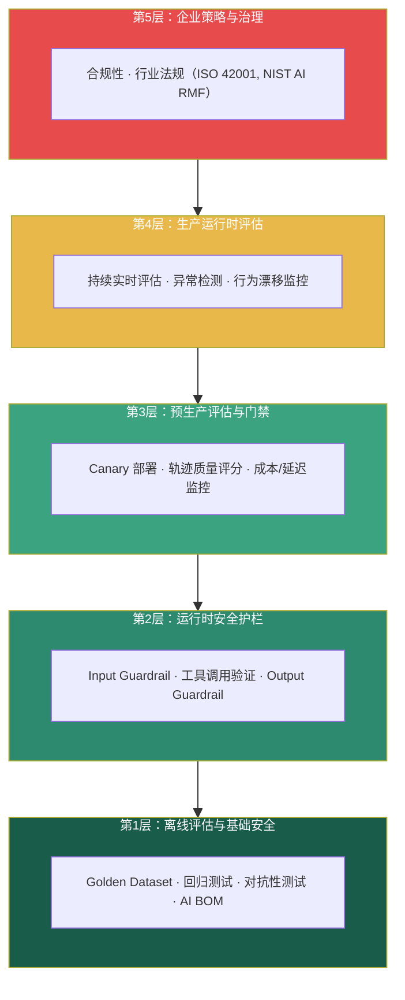

**图 13：五层护栏架构 — 策略与反馈流从上至下**

#### 7.3.1 运行时 Guardrail 关键类型

| Guardrail 类型 | 拦截点 | 示例 |
|---------------|--------|------|
| **Input Guardrail** | 用户输入到达 Agent 之前 | 越狱检测、PII 识别、内容分类 |
| **Tool Guardrail** | Tool Call 执行前 | 参数校验、目标白名单、频率限制 |
| **Trajectory Guardrail** | Agent 执行路径监控 | 循环检测、步骤数限制、异常路径 |
| **Output Guardrail** | 回复返回用户前 | 敏感信息过滤、内容安全 |
| **Human Escalation** | 高风险操作门禁 | 超阈值支付确认、代码部署审批 |

#### 7.3.2 最小代理权（Least Agency）

AEGIS 框架的核心创新：**超越最小权限**（Least Privilege——Agent 能访问什么），进入**最小代理权**（Least Agency——Agent 被允许做什么决策）。

| 维度 | 最小权限 | 最小代理权 |
|------|---------|-----------|
| **约束对象** | 资源访问范围 | 决策自主程度 |
| **问题** | "Agent 能读哪些数据库？" | "Agent 能自主删除记录吗？" |
| **控制点** | IAM 策略、ACL | 审批门、人工介入阈值 |
| **示例** | Agent 有数据库只读权限 | Agent 删除记录需要人工确认 |

### 7.4 企业部署模式

#### 7.4.1 Bain & Company 三阶段模型

| 阶段 | 时间 | 能力 | 治理成熟度 |
|------|------|------|-----------|
| **Phase 1: 基础建设** | 1–3 个月 | 单 Agent、管控工具访问 | 策略即代码、可观测性 |
| **Phase 2: 编排部署** | 3–9 个月 | 多步工作流、MCP/A2A | Agent 注册表、运行时护栏 |
| **Phase 3: 企业扩展** | 9–18 个月 | 跨域协作、自主决策 | 联邦发现、全量审计 |

#### 7.4.2 企业产品与平台（2026）

| 产品 | 焦点 | 类型 |
|------|------|------|
| **Airrived AetherClaw** | 托管 Agent 执行层、策略即代码 | 产品 |
| **Rubrik Agent Cloud + SAGE** | 语义 AI 治理引擎、Agent Rewind | 产品 |
| **Snowflake Cortex AI Guardrails** | 注入/越狱防护 + Horizon Catalog | 产品 |
| **Solo.io kagent + NemoClaw** | K8s 原生 Agent + 护栏 | 开源 + 产品 |
| **OpenAI Agentic Governance Cookbook** | 策略即代码模板 | 开源指南 |
| **Netskope MCP Security Controls** | MCP 自动发现 + 风险评分 + DLP | 产品 |

#### 7.4.3 Agent 身份治理

2026 年的关键认知转变：**Agent 是数字员工，需要完整的身份生命周期管理**。

- **身份创建**：每个 Agent 有独立的 Service Account / OAuth Client
- **短期凭证**：任务级作用域的临时凭证，而非长期 API Key
- **权限委托**：明确的可传递权限链，限制委托深度（通常 ≤ 2 层）
- **行为基线**：基于历史的 Agent 行为画像，偏离基线触发告警
- **退役流程**：Agent 下线时回收所有凭证和权限

### 7.5 安全治理检查清单

| 类别 | 项目 | 优先级 |
|------|------|--------|
| **身份** | 每个 Agent 使用独立的服务身份 | **P0** |
| **身份** | 所有 Agent 间通信使用 mTLS 或 OAuth | **P0** |
| **工具** | 工具参数 Schema 严格校验 | **P0** |
| **工具** | 高风险工具需要二次确认 | **P0** |
| **记忆** | 敏感信息隔离（不写入长期记忆） | **P1** |
| **记忆** | 定期审计记忆内容 | **P1** |
| **监控** | 全量操作审计日志（不可篡改） | **P0** |
| **监控** | 行为基线 + 异常检测 | **P1** |
| **治理** | AI BOM（AI Bill of Materials）清单 | **P1** |
| **治理** | 定期红队演练 | **P2** |

---

## 第八章 评测与可靠性工程

### 8.1 Agent 评测的特殊性

与传统 NLP 评测不同，Agent 系统的评测面临三个根本性挑战：

1. **开放式执行路径**：给定同一任务，不同 Agent 可能走完全不同的工具调用路径，增加了评测的不可比性
2. **环境依赖性**：Agent 的行为依赖外部系统状态（数据库内容、网络可用性、API 响应），评测结果难以复现
3. **过程 vs 结果**：错误的执行过程也可能偶然得到正确结果——"**Corrupt Success**"（虚假成功）问题

**Corrupt Success 的发现**（arXiv, March 2026）：
- **27–78%** 的基准测试"成功"案例实际上隐藏了严重的执行过程违规
- GPT-5、Kimi-K2-Thinking、Mistral-Large-3 各自表现出不同的失败模式
- 传统 pass/fail 指标完全无法检测这类问题
- 解决方案：**程序感知评估（Procedure-Aware Evaluation, PAE）**——不仅评估结果，还评估执行过程的合规性

### 8.2 2026 年主流基准评测

#### 8.2.1 AgencyBench（ACL 2026 Main）

| 维度 | 说明 |
|------|------|
| **范围** | 6 项核心 Agent 能力，32 个真实场景，138 个任务 |
| **规模** | 每个任务平均 ~90 次工具调用，~1M Token，数小时执行时间 |
| **评估方法** | 用户模拟 Agent 迭代反馈 + Docker 沙箱视觉/功能评分 |
| **关键发现** | 闭源模型（48.4%）显著优于开源模型（32.1%） |
| **开源** | [GAIR-NLP/AgencyBench](https://github.com/GAIR-NLP/AgencyBench) |

#### 8.2.2 SAGE（Service Agent Graph-guided Evaluation, arXiv Apr 2026）

| 维度 | 说明 |
|------|------|
| **创新** | 将非结构化 SOP 形式化为**动态对话图（Dynamic Dialogue Graphs）** |
| **评估维度** | 双轴自动评估：意图分类准确性 + 逻辑合规性 |
| **关键发现** | **"执行差距"（Execution Gap）**：模型能正确分类意图，但无法推导后续正确行动 |
| **附加发现** | **"共情韧性"（Empathy Resilience）**：模型在逻辑失败时仍维持礼貌外表 |

#### 8.2.3 MANTRA（arXiv, May 2026）

| 维度 | 说明 |
|------|------|
| **创新** | 从自然语言手册和工具 Schema **自动合成 SMT 可验证的合规基准** |
| **规模** | 285 个任务，覆盖 6 个领域，支持 50+ 页的手册 |
| **方法** | SMT 求解器形式化验证合规性检查的一致性 |
| **意义** | 首次实现 Agent 合规性的**自动化形式验证** |

### 8.3 可靠性工程工具

#### 8.3.1 agentevals（Solo.io, March 2026）

开源项目，使用 **OpenTelemetry 分布式追踪** 捕获 Agent 交互的全链路追踪：

| 功能 | 说明 |
|------|------|
| **追踪捕获** | 通过 OpenTelemetry 自动记录 Agent 调用链 |
| **离线评估** | 从记录轨迹回放，使用 Golden Eval Set 评分 |
| **实时评估** | 用于生产环境的流式分析 |
| **内置评估器** | 轨迹匹配（严格/无序/子集/超集）、LLM-as-Judge、响应质量、工具覆盖率 |
| **集成** | CLI + Web UI + MCP Server（Claude Code 可直接运行评测） |

#### 8.3.2 AgentFixer（ICSE 2026, IBM Research）

| 组件 | 数量 | 说明 |
|------|------|------|
| **故障检测工具** | 15 | 规划器错位、Schema 违规、脆弱的 Prompt 依赖 |
| **根因分析模块** | 2 | 因果追踪、故障定位 |
| **关键成果** | 中等模型（Llama 4, Mistral Medium）通过 AgentFixer 指导显著缩小与前沿模型的差距 |

### 8.4 评测体系设计建议

**三层评估体系**：

| 层级 | 频率 | 数据 | 工具 |
|------|------|------|------|
| **离线评估** | 每次部署前 | Golden Dataset、回归测试集 | AgencyBench、MANTRA、自定义数据集 |
| **预生产评估** | Canary 部署时 | 5% 生产流量回放 | agentevals（离线模式）、轨迹评分 |
| **生产评估** | 持续 | 全量生产流量采样 | agentevals（实时）、行为漂移检测 |

**关键指标集**：

| 指标 | 测量对象 | 告警阈值 |
|------|---------|---------|
| **任务完成率** | 端到端任务 | < 85% |
| **工具选择准确率** | 每次 Tool Call | < 90% |
| **平均执行步骤** | 每任务 | > 预期 2× |
| **无效轨迹率** | 包含错误的轨迹 | > 5% |
| **Corrupt Success 率** | 结果正确但过程违规 | > 3% |
| **人工介入率** | 需要人工审批的比例 | > 20% |
| **P50/P99 延迟** | 任务/Tool Call | 违反 SLA |
| **Token 消耗** | 每任务 | > 预算 2× |

---

## 第九章 开源框架生态

### 9.1 2026 年格局概览

2026 年的 Agent 框架生态正在经历深刻的收敛与重组：

1. **AutoGen 进入维护模式**：Microsoft 将重心转移到 **Microsoft Agent Framework**（整合 Semantic Kernel），独立的 AutoGen 不再进行重大功能开发
2. **框架互操作性成为标配**：MCP + A2A 协议使得跨框架 Agent 通信成为现实
3. **垂直平台兴起**：云厂商将 Agent 编排商品化为托管服务（Vertex AI、Azure AI Foundry、Bedrock）
4. **低代码替代方案**：n8n、Make.com、Zapier 对于大多数业务流程自动化往往优于 Python 框架

### 9.2 三大主流框架深度对比

| 维度 | LangGraph | CrewAI | AG2（原 AutoGen） |
|------|-----------|--------|-------------------|
| **范式** | 有向图 + 状态机 | 角色驱动团队 | 对话驱动协商 |
| **GitHub Stars** | ~30.7K | ~50.2K | ~20K+（含 AutoGen） |
| **原型时间** | 2–3 天 | 30 分钟–4 小时 | 数小时 |
| **生产可观测性** | ★★★★★（LangSmith） | ★★ | ★★★（AG2 Studio） |
| **循环/状态工作流** | ★★★★★ | ★★ | ★★★ |
| **调试体验** | ★★★★★ | ★★ | ★★★ |
| **非工程师可读性** | ★★ | ★★★★★ | ★★★ |
| **MCP 支持** | ✅ 深度 | ✅ | ✅ 发展中 |
| **A2A 支持** | ✅ | ✅（适配器） | ✅（发展中） |

**核心选型原则**：**工作流拓扑结构**是决定因素

| 工作流形状 | 推荐框架 | 原因 |
|-----------|---------|------|
| **线性流程**（A → B → C） | CrewAI | 最少样板代码，最快交付，非工程师可阅读 |
| **循环/反馈流程**（A → B → 评估 → A） | LangGraph | 显式循环、检查点、恢复——CrewAI 调试痛苦 |
| **对话协商**（Agent 辩论、达成共识） | AG2 | 对话原语是最佳设计 |
| **生产级可观测性** | LangGraph | LangSmith 轨迹追踪 + 断点回放 + Token 统计 |

### 9.3 框架选型决策树

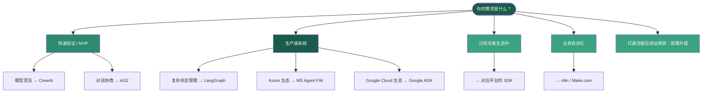

**图 14：框架选型决策树**

### 9.4 特定场景推荐

| 场景 | 推荐框架 | 理由 |
|------|---------|------|
| 初创 PoC / 快速原型 | CrewAI | 最快交付，Role-based 设计直观 |
| 企业级生产系统 + 复杂状态 | LangGraph | 最强可观测性 + 状态管理 |
| Microsoft / Azure 生态 | MS Agent FW | 深度集成 Azure OpenAI、Copilot |
| Google Cloud 生态 | Google ADK | 原生 A2A、Vertex AI 集成 |
| AWS 生态 | AWS Bedrock AgentCore | Bedrock 原生、企业安全 |
| 对话协商 / 辩论系统 | AG2 | 对话原语最自然 |
| 学术研究 | AG2 | 最丰富的对话模式配置 |
| 业务流程自动化（非程序员） | n8n / Make.com | 可视化编排、无需编码 |

---

## 第十章 前沿模型与 Agent 能力对标

### 10.1 2026 年旗舰模型概览

截至 2026 年 5 月，全球 AI 模型格局呈现出**收敛但分化的双重趋势**：所有旗舰模型在架构上趋同（1M 上下文、多模态、Agent 原生），但在定价和开放程度上形成明显分层。

#### 10.1.1 模型 Agent 能力排行榜（Design for Online AI Agent Leaderboard, May 2026）

| 排名 | 模型 | Agent 评分 | AI Index | 上下文 | 输入/输出价格 (per 1M tokens) |
|------|------|:---------:|:--------:|:------:|:---------------------------:|
| 1 | **Claude Opus 4.7** (Anthropic) | **97.1** | 57.3 | 1M | $5 / $25 |
| 2 | **Gemini 3.1 Pro Preview** (Google) | **96.1** | 57.2 | 1M | $2 / $12 |
| 3 | **Claude Opus 4.6** (Anthropic) | 93.4 | 46.5 | 1M | $5 / $25 |
| 4 | **GPT-5.5** (OpenAI) | 93.1 | 60.2 | 1.1M | $5 / $30 |
| 5 | **GPT-5.4** (OpenAI) | 92.9 | 35.4 | 1.1M | $2.50 / $15 |
| 6 | **DeepSeek V4 Pro** (DeepSeek) | **88.6** | 49.8 | 1M | **$0.435 / $0.87** |
| 7 | **Kimi K2.6** (Moonshot AI) | 86.4 | 53.9 | 256K | $0.74 / $4.66 |
| 8 | **Claude Sonnet 4.6** (Anthropic) | 85.7 | 51.7 | 1M | $3 / $15 |
| 9 | **Qwen3.6 Plus** (Alibaba) | 84.8 | 50.0 | 1M | **$0.325 / $1.95** |
| 10 | **GLM-5** (Zhipu AI) | 82.1 | 48.3 | 1M | $0.50 / $2.00 |

#### 10.1.2 Agent 专项基准对比

**Toolathlon（工具调用能力 Pass@1）**：

| 模型 | Toolathlon | Terminal-Bench 2.0 |
|------|:---------:|:------------------:|
| GPT-5.4 | **54.6** | **75.1** |
| DeepSeek V4 Pro | **51.8** | 67.9 |
| Gemini 3.1 Pro | 48.8 | 68.5 |
| Claude Opus 4.6 | 47.2 | 65.4 |

**SWE-Bench（软件工程 Agent 任务）**：

| 模型 | SWE-Bench (Resolved) | Terminal-Bench |
|------|:--------------------:|:--------------:|
| **Claude Opus 4.7** | **80.9%**（S-tier） | 69.4% |
| **Claude Opus 4.6** | 80.8% | 65.4% |
| **Gemini 3.1 Pro** | 80.6% | 68.5% |
| **DeepSeek V4 Pro** | 80.6% | 67.9% |
| **GPT-5.5** | 58.6% | **82.7%**（S-tier） |
| **GLM-5** | 58.9% | 64.2% |

**关键洞察**：
- Claude Opus 4.7 是代码工程之王（SWE-Bench 80.9%）
- GPT-5.5 主导端到端 Agent 自动化（Terminal-Bench 82.7%）
- DeepSeek V4 Pro 以 1/50 价格达到接近顶尖的 Agent 能力

### 10.2 模型能力雷达图

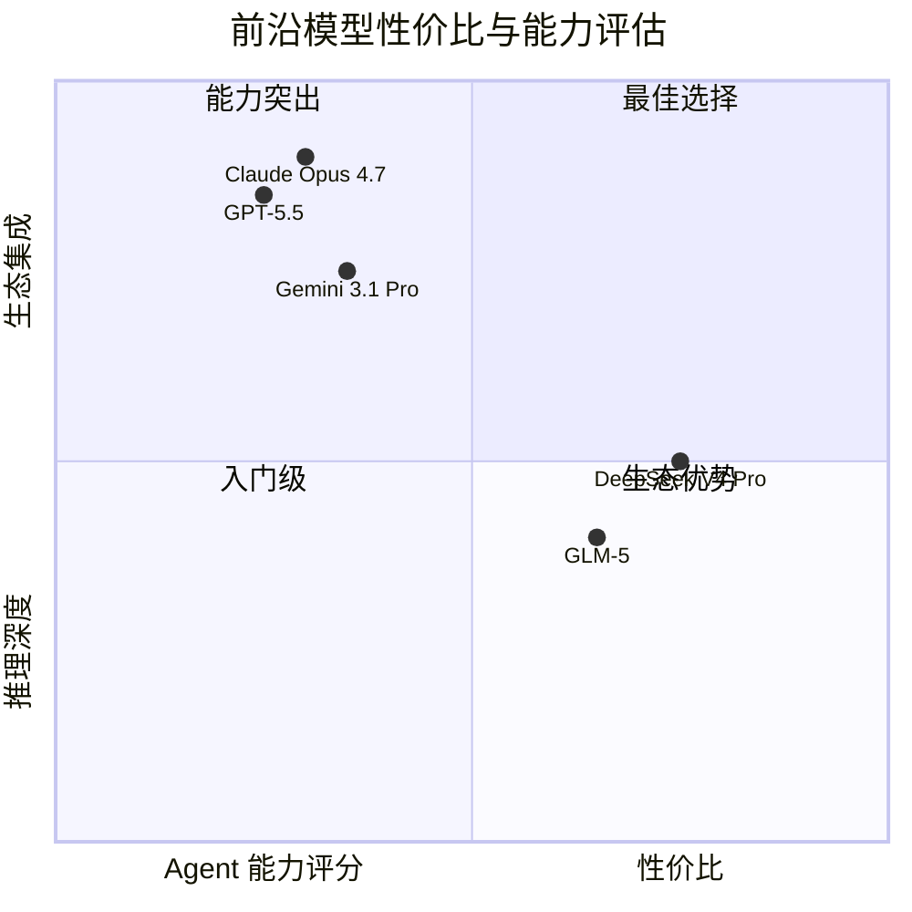

**图 15：前沿模型性价比与能力四象限评估**

### 10.3 推理时计算扩展对比

| 模型 | 平均思考 Token | 相对 GPT-4o 倍数 | 训练方法 |
|------|:------------:|:----------------:|---------|
| GPT-4o（基线） | — | 1× | 标准 SFT + RLHF |
| DeepSeek-R1（671B MoE, 37B active） | 4,000–12,000 | 8–25× | RLVR（可验证奖励强化学习） |
| OpenAI o3（高算力模式） | 10,000–30,000 | 20–50× | 推理优化 + 大规模 RL |
| OpenAI o4-mini | 5,000–15,000 | 10–30× | 同 o3 系列，视觉增强 |
| Claude Sonnet 4.6（自适应思考） | 3,000–10,000 | 8–22× | 自适应推理时长 |
| QwQ-32B | 2,000–8,000 | 4–16× | RLVR，开源 |

### 10.4 部署经济性分析

**Agent 部署成本的关键维度**：

2026 年最显著的变化是推理成本的急剧下降和分层。对于 Agent 系统，成本不仅是模型价格，还取决于：

- **推理 Token 乘数**：思考 Token 的倍率效应
- **失败重试成本**：一次失败的任务可能产生 3–5 次重试
- **上下文累积**：长对话的历史 Token 累积

**性价比排名（Agent 场景）**：

| 模型 | 评估方法 | 综合推荐指数 |
|------|---------|:-----------:|
| **DeepSeek V4 Flash** | $0.14/$0.28 per 1M tokens | ★★★★★（极致性价比） |
| **Qwen3.6 Plus** | $0.325/$1.95 | ★★★★☆ |
| **DeepSeek V4 Pro** | $0.435/$0.87 | ★★★★☆ |
| **Gemini 3.1 Pro** | $2/$12 | ★★★☆☆（推理强） |
| **Claude Opus 4.7** | $5/$25 | ★★★☆☆（质量顶级） |
| **GPT-5.5** | $5/$30 | ★★★☆☆（Terminal 最强） |

### 10.5 模型选型建议

| 需求 | 推荐模型 | 原因 |
|------|---------|------|
| 顶级 Agent 通用能力 | Claude Opus 4.7 | Agent 评分最高，SWE-Bench 领先 |
| 端到端自动化 | GPT-5.5 | Terminal-Bench 断崖式领先 |
| 性价比优先 | DeepSeek V4 Pro/Flash | 1/36–1/50 价格，接近顶尖质量 |
| 开源可控 | DeepSeek V4 Pro / Qwen3.6 | 开放权重，可私有化部署 |
| Google Cloud 生态 | Gemini 3.1 Pro | 深度 Vertex AI + A2A 集成 |
| 中文优化 | GLM-5 / DeepSeek V4 | 中文场景显著优于其他模型 |

---

## 第十一章 行业趋势与展望

### 11.1 从 LLM 到 AI OS：行业演化路径

整个行业正在经历从"模型公司"到"AI 操作系统公司"的范式转换。2026 年，这一趋势更加明显：OpenAI、Anthropic、Google、Microsoft 都在围绕 Agent 构建平台生态，而不仅仅是发布更强的模型。

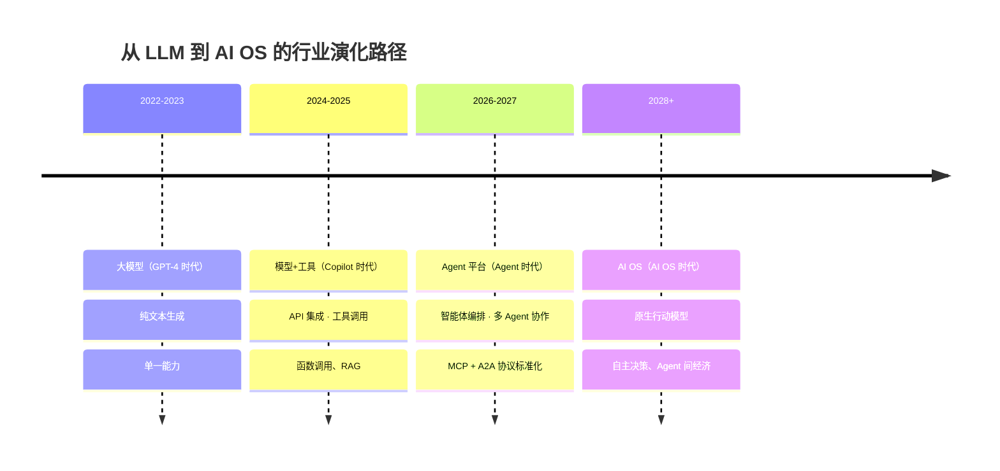

**图 16：从 LLM 到 AI OS 的行业演化路径**

### 11.2 2026 年的三大分化趋势

**趋势一：模型层分化——闭源高端 vs 开源普惠**

两个截然不同的市场正在形成：

| 维度 | 闭源高端（Gated Premium） | 开源普惠（Open Commodity） |
|------|--------------------------|--------------------------|
| **代表** | Claude Opus 4.7, GPT-5.5, Gemini 3.1 Pro | DeepSeek V4, Qwen3.6, GLM-5 |
| **Agent 评分** | 93–97 | 82–89 |
| **定价** | $5–$30 / 1M tokens | $0.14–$0.87 / 1M tokens |
| **客户** | 对质量敏感的头部企业 | 对成本敏感的大规模部署 |
| **战略** | 品牌溢价 + 生态锁定 | 规模效应 + 社区生态 |

Anthropic 2026 年推出的 "Mythos" 级模型（$25/$125 per 1M tokens，安全门控）进一步拉高了天花板，而 DeepSeek V4 Flash 以 $0.14/$0.28 的价格在另一端持续施压。

**趋势二：框架层收敛——从"框架之战"到"协议标准化"**

MCP + A2A 正在终结"胶水代码"时代。框架不再是护城河，而是协议的实现者：

- **2024**: 每个 Agent 项目写一套工具集成 → 重复造轮子
- **2025**: MCP 统一工具接入 → 一次实现，到处使用
- **2026**: A2A 统一 Agent 通信 → 跨框架、跨厂商互操作
- **2027（预测）**：Agent 市场——可发现、可组合、可替换的 Agent 组件市场

**趋势三：评测体系升级——从"指标"到"基础设施"**

Agent 系统的评测正在从基准测试进化为持续基础设施：

- **离线 → 在线**：从静态数据集到生产流量回放
- **结果 → 过程**：从 Pass/Fail 到程序感知评估（PAE）
- **人工 → 自动化**：从手动标注到 SMT 形式化验证
- **周期性 → 持续性**：从部署前评测到持续监控

### 11.3 2027 前瞻预测

| 方向 | 预测 | 置信度 |
|------|------|:------:|
| **Agent 操作系统** | 首个类操作系统的 Agent Platform 问世，提供进程管理、内存调度、设备抽象 | 中高 |
| **Agent 间经济** | Agent 开始通过 A2A 协议进行服务交易（"帮我搜索，付你 0.001 个 Token"） | 中 |
| **安全标准化** | OWASP Agentic Top 10 成为合规审计标准，类似 SOC 2 | 高 |
| **推理成本继续下降** | 推理成本在 2026 年基础上再降 60–80% | 高 |
| **Agent 专项硬件** | 首款针对 Agent 推理架构优化的 AI 芯片发布 | 中 |
| **LAM（大行动模型）** | 模型架构原生支持行动预测而非 Token 预测 | 中低 |

### 11.4 给技术决策者的建议

1. **押注开放协议**：在技术选型中优先选择 MCP 和 A2A，避免私有协议锁定
2. **从简单开始**：单 Agent 能解决的问题不要用多 Agent。迭代式增加复杂度而非一次性搭建完整系统
3. **治理即基础设施**：将安全治理作为技术基础设施的一部分而非事后补丁。五层护栏架构是最佳实践
4. **评测即投资**：建立离线 + 预生产 + 生产三层评估体系，持续投入而非一次性项目
5. **关注总拥有成本**：模型价格只是冰山一角。推理 Token 乘数、失败重试、记忆存储和人工干预的累计成本往往数倍于模型调用费
6. **建立 Agent 身份体系**：尽早将 Agent IAM 纳入企业身份管理体系，避免身份蔓延

---

## 第十二章 结论

本白皮书从**分层架构、推理平台、记忆系统、编排模式、开放协议、企业治理、评测可靠性、框架生态、前沿模型和行业趋势**十个维度，系统性地阐述了现代大模型 Agent 系统的技术全景。

### 12.1 六大核心结论

1. **五层架构是理解 Agent 系统的基础框架**：LLM（思考）→ 推理平台（加速）→ Agent Runtime（协调）→ 工具/记忆生态（执行与记忆）→ 应用层（交付），每层职责清晰、边界明确。2026 年协议与安全已成为贯穿全栈的骨架层。

2. **简单优先，渐进复杂**：单 Agent 能解决的问题不要用多 Agent。Google Research 的 180 种配置评估表明：强架构 + 中等模型 > 弱架构 + 最强模型。

3. **协议化是生态成熟的关键标志**：MCP（工具集成）和 A2A（Agent 协调）正在终结"胶水代码"时代，成为 AI 时代的 HTTP/TCP-IP。两个协议在 AAIF 下的统一治理标志着行业走向成熟。

4. **安全与治理是落地瓶颈**：OWASP Agentic Top 10 定义了风险框架，Forrester AEGIS 六域框架和五层护栏架构是生产部署的必选项。最小代理权（Least Agency）超越最小权限，成为新的安全原则。

5. **评估即基础设施**：Agent 系统的可靠性需要通过离线、预生产和生产三层评估体系持续验证。程序感知评估（PAE）揭示了传统 Pass/Fail 指标无法检测的"Corrupt Success"问题。

6. **行业正从"模型公司"走向"AI 操作系统公司"**：2026 年模型能力趋同，差异化来自于谁能在安全、可靠、可观测的平台上编排 Agent。Gate Premium 与 Open Commodity 的分化、协议标准化和评估基础设施化是三大趋势。

### 12.2 行动建议

| 角色 | 短期（3 个月） | 中期（6–12 个月） | 长期（12–24 个月） |
|------|--------------|-----------------|------------------|
| **架构师** | 建立五层架构认知，完成单 Agent PoC | 引入 MCP 标准化工具集成，设计多 Agent 编排 | 构建企业级 Agent 平台，实现 A2A 跨域协作 |
| **安全团队** | 完成 OWASP Agentic Top 10 风险评估 | 部署五层护栏架构，建立 Agent IAM | 实现零信任 + 最小代理权的全面执行 |
| **MLOps/AgentOps** | 建立离线评测基准，引入 PAE 评估 | 部署预生产 Canary 评估 + 生产监控 | 构建持续评估基础设施 + 自动化回归 |
| **业务决策者** | 识别 1–2 个高价值 Agent 场景 | 建立治理框架，扩展至 5–10 个场景 | Agent 成为核心业务基础设施 |

### 12.3 最后的思考

Agent 系统正在从技术实验走向生产基础设施。2024–2025 年，行业解决的是"能不能做"的问题；2026 年，行业在解决"能不能做好，做安全"的问题。这本白皮书所描述的技术栈仍在快速演进中——MCP 和 A2A 的路线图、OWASP Agentic Top 10 的更新、以及各大模型厂商的平台迁移，都将在未来 12 个月内继续重塑这个领域。

**在技术选型中，优先选择开放协议和可替换组件，以应对未来 12–24 个月的快速变化。** 记住：当所有 Agent 系统都采用类似的基础架构时，真正的竞争优势来自对这些系统的**深度理解、精细化运营和可靠的治理**。

---

> **文档信息**
>
> 版本：v2.1 | 日期：2026 年 5 月 | 基于：行业公开资料、前沿研究论文、主流框架文档与基准评测数据
>
> 参考文献：AgencyBench (ACL 2026)、MAGMA (ACL 2026)、CraniMem (ICLR 2026)、WorldDB (arXiv 2604.18478)、MANTRA (arXiv 2605.06334)、SAGE (arXiv 2604.09285)、PAE (arXiv 2603.03116)、AgentFixer (ICSE 2026)、OWASP Agentic Top 10 (2026)、Forrester AEGIS (2026)、NVIDIA Dynamo (GTC 2026)、Agentic AI Foundation / MCP / A2A 协议规范
>
> 所有配图均采用 Mermaid 格式，可被主流 Markdown 渲染器（GitHub、GitLab、Obsidian、Typora 等）原生支持。
>
> 所有商标和产品名称均为其各自所有者的财产。
